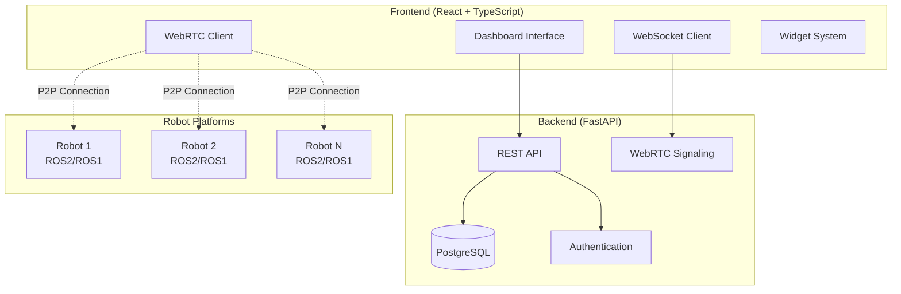

# AI-GCS-Server: WebRTC-based Real-time Control and Monitoring Interface for Multi-Robot Systems

[](https://opensource.org/licenses/MIT)
[](https://www.python.org/)
[](https://reactjs.org/)
[](https://fastapi.tiangolo.com/)

A real-time robot controlling and monitoring system using WebRTC technology for low-latency communication between operators and multiple robotic platforms.

## 📋 Overview

This project provides a comprehensive WebRTC-based infrastructure for real-time robot control and monitoring. The system enables real-time bidirectional communication through WebRTC data channels and media streams, providing operators with live video feeds, sensor data, and responsive control interfaces.

### 🏗️ System Architecture



## ✨ Key Features

### 🔄 Real-time Communication
- **Low-latency control and monitoring** between robot and user using WebRTC peer-to-peer connections
- **WebSocket signaling server** for connection establishment
- **Automatic reconnection** and connection state management

### 🤖 Multi-Robot Support
- **Simultaneous control** of multiple heterogeneous robots
- **Dynamic robot discovery** and connection management
- **Individual robot status monitoring** and control

### 📹 Live Video Streaming
- **Real-time camera feeds** with adaptive quality
- **Multiple video streams** per robot (MSID-based routing)
- **FPS monitoring** and stream statistics
- **MediaStream optimization** for low-latency transmission

### 📊 Sensor Data Streaming
- **Live telemetry and sensor data** transmission via DataChannels
- **Protobuf-based data serialization** for efficient transmission
- **Real-time data visualization** through customizable widgets
- **Historical data tracking** and analysis

### 🎮 Bidirectional Control
- **Send commands and receive feedback** in real-time
- **Remote control interfaces** for robot manipulation
- **Command history tracking** and validation
- **Emergency stop functionality**


### 📈 Scalable Architecture
- **Modular design** supporting easy extension to new robot platforms
- **Widget-based dashboard** for flexible data visualization
- **Plugin architecture** for custom functionality
- **Microservices-ready** deployment options

## 🚀 Quick Start

### Prerequisites

- **Docker & Docker Compose** (for production deployment)
- **Python 3.11+** (for development)
- **Node.js 18+** (for frontend development)
- **PostgreSQL 13+** (for data storage)

### Development Setup

1. **Clone the repository**
   ```bash
   git clone https://github.com/your-org/ai-gcs-server.git
   cd ai-gcs-server
   ```

2. **Setting .env file**

    Set up the `.env` file for the backend and the `frontend/.env` file for the frontend. Each environment file configures environment variables for its respective service.


3. **Backend Setup**
   ```bash
   cd backend
   uv sync
   source .venv/bin/activate
   uvicorn app.main:app --reload --host 0.0.0.0 --port 8000
   ```

4. **Frontend Setup**
   ```bash
   cd frontend
   npm install
   npm run dev
   ```

5. **Database Setup**
   ```bash
   # need pre-setup local postgresql
   cd backend
   alembic upgrade head
   ```

### Production Deployment

1. change .env file which located on deploy/prod

2. create docker network named "proxy"
   ```bash
   docker network create proxy
   ```

3. run docker compose command below:
   ```bash
   # Using Docker Compose
   docker-compose -f deploy/prod/docker-compose.backend.yaml up -d
   docker-compose -f deploy/prod/docker-compose.frontend.yaml up -d
   ```

For detailed deployment instructions, see [Deployment Guide](docs/DEPLOYMENT.md).

## 📖 Usage Guide

### Connecting Robots

1. **Robot Registration**: Register your robot through the admin interface
2. **WebRTC Setup**: Configure robot-side WebRTC client with signaling server
3. **Connection Establishment**: Establish P2P connection through signaling
4. **Data Streaming**: Start streaming video and sensor data

### Dashboard Configuration

1. **Create Dashboard**: Set up custom dashboard layouts
2. **Add Widgets**: Configure widgets for different data types
3. **Robot Mapping**: Map widgets to specific robot data streams
4. **Real-time Monitoring**: Monitor and control robots in real-time

### Widget System

- **Video Widgets**: Display live camera feeds
- **Sensor Widgets**: Visualize sensor data (position, velocity, etc.)
- **Control Widgets**: Send commands to robots
- **Custom Widgets**: Create custom visualization components

## 🔧 Development Guide

### Adding New Robot Platforms

1. **Robot Client**: Implement WebRTC client for your robot
2. **Data Parsing**: Create data parsers for your sensor types
3. **Widget Integration**: Add widgets for your robot's data
4. **Testing**: Test with the signaling server

### Creating Custom Widgets

1. **Widget Template**: Use the universal widget template
2. **Data Integration**: Connect to appropriate data stores
3. **UI Components**: Build responsive UI components
4. **Configuration**: Add configuration options

### API Documentation

- **WebSocket API**: See [WebSocket Documentation](docs/WEBSOCKET_API.md)
- **WebRTC Setup**: See [MediaStream Setup](docs/MEDIASTREAM_SETUP.md) and [DataChannel Setup](docs/DATACHANNEL.md)

## 🏗️ Project Structure

```
ai-gcs-server/
├── backend/                 # FastAPI backend
│   ├── app/
│   │   ├── api/            # REST API endpoints
│   │   ├── websocket/      # WebRTC signaling
│   │   ├── schemas/        # Pydantic models
│   │   └── core/           # Core configuration
│   ├── alembic/            # Database migrations
│   └── pyproject.toml      # Python dependencies
├── frontend/               # React frontend
│   ├── src/
│   │   ├── components/     # React components
│   │   ├── dashboard/      # Dashboard system
│   │   ├── rtc/           # WebRTC client
│   │   └── hooks/         # Custom React hooks
│   └── package.json       # Node.js dependencies
├── docs/                  # Documentation
└── deploy/               # Deployment configurations
```

## 📄 License

This project is licensed under the MIT License - see the [LICENSE](LICENSE) file for details.
