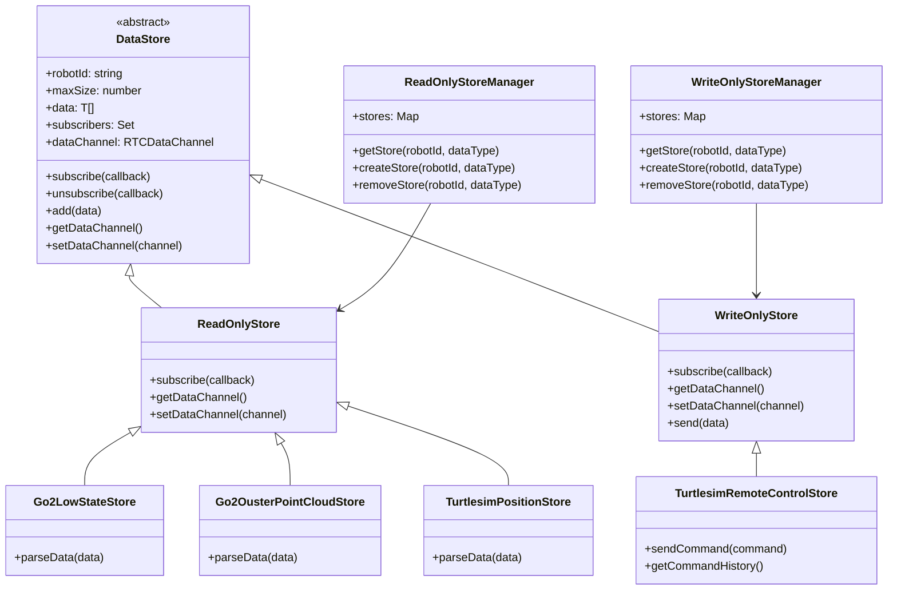
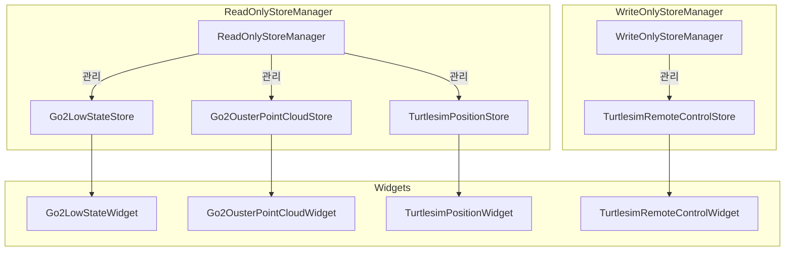
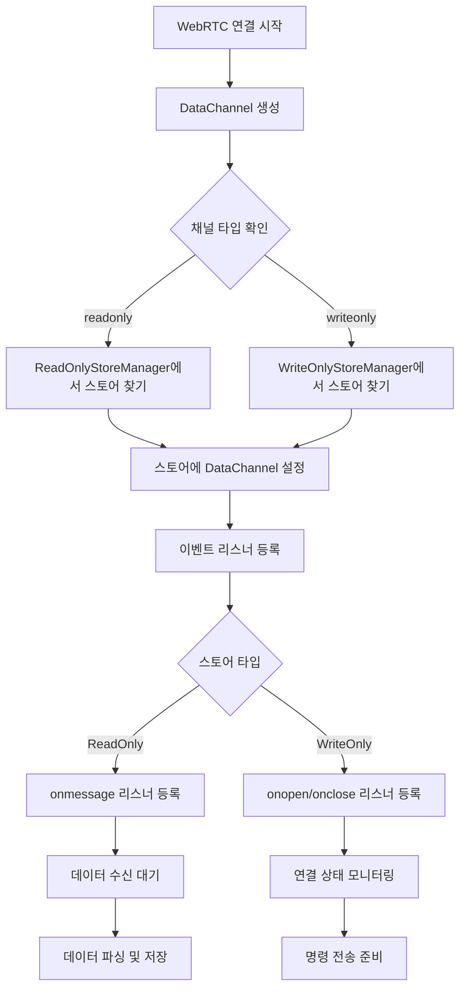
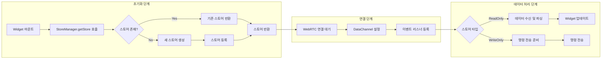
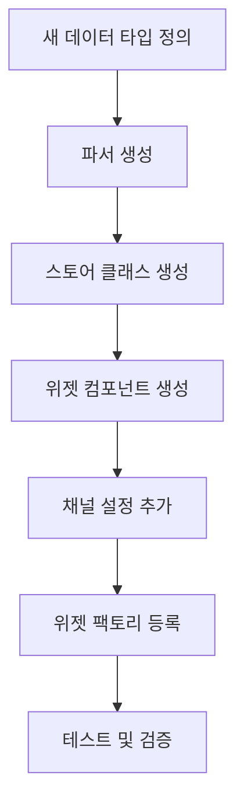
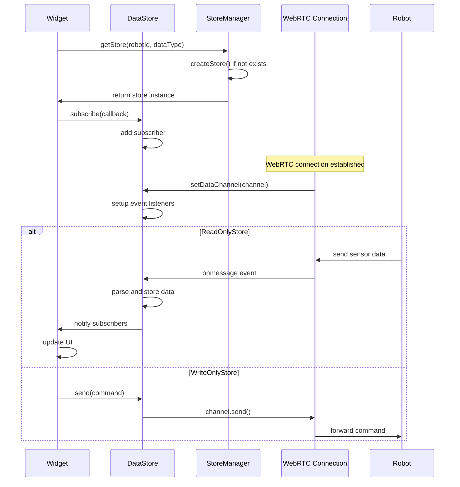
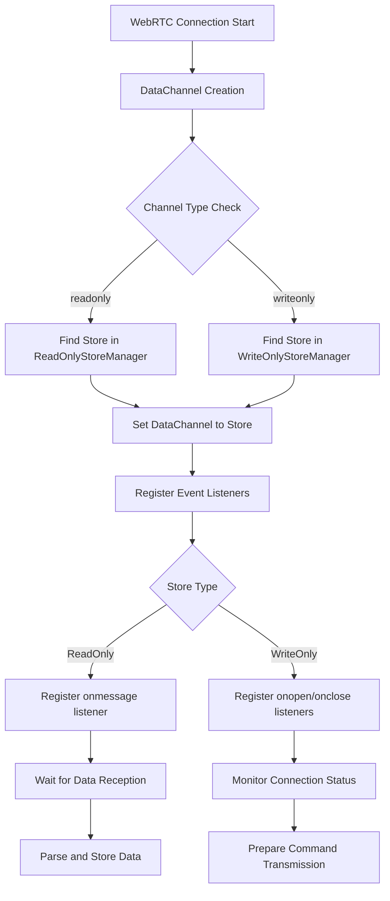
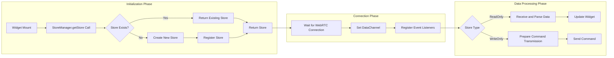
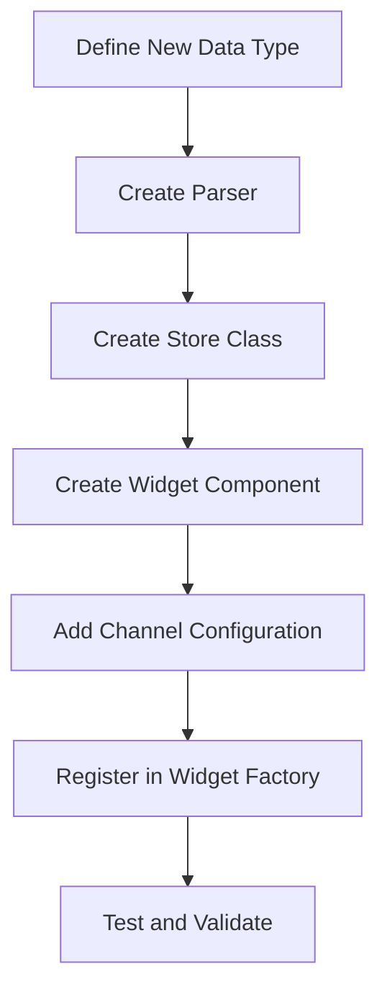

# DataChannel Setup and Management Guide


## 목차
1. [DataChannel 스토어 상속 구조](#1-datachannel-스토어-상속-구조)
2. [DataChannel 라이프사이클 및 연결 방식](#2-datachannel-라이프사이클-및-연결-방식)
3. [새로운 DataChannel 타입 추가 방법](#3-새로운-datachannel-타입-추가-방법)

---

## 1. DataChannel 스토어 상속 구조

### 1.1 전체 상속 구조 다이어그램



### 1.2 읽기 전용 vs 쓰기 전용 스토어 비교

| 구분 | ReadOnlyStore | WriteOnlyStore |
|------|---------------|----------------|
| **목적** | 데이터 수신 및 파싱 | 명령 전송 |
| **데이터 흐름** | WebRTC → Store → Widget | Widget → Store → WebRTC |
| **주요 메서드** | `subscribe()`, `getDataChannel()` | `subscribe()`, `send()`, `getDataChannel()` |
| **사용 사례** | 센서 데이터, 위치 정보, 포인트 클라우드 | 원격 제어, 명령 전송 |
| **데이터 처리** | 자동 파싱 및 저장 | 명령 히스토리 관리 |

### 1.3 스토어 매니저 구조



---

## 2. DataChannel 라이프사이클 및 연결 방식

### 2.1 전체 연결 과정 다이어그램


### 2.2 DataChannel 설정 과정



### 2.3 스토어 생성 및 관리 흐름



---

## 3. 새로운 DataChannel 타입 추가 방법

### 3.1 추가 과정 개요



### 3.2 단계별 상세 가이드

#### 3.2.1 1단계: 데이터 타입 및 파서 정의

**파일 위치**: `frontend/src/dashboard/parser/`

```typescript
// new-data-type.ts
export interface ParsedNewDataType {
  timestamp: number;
  value1: number;
  value2: string;
  // ... 기타 필드
}

export function parseNewDataType(data: string): ParsedNewDataType {
  const parsed = JSON.parse(data);
  return {
    timestamp: Date.now(),
    value1: parsed.value1,
    value2: parsed.value2,
    // ... 파싱 로직
  };
}
```

#### 3.2.2 2단계: 스토어 클래스 생성

**읽기 전용 스토어 예시**:
```typescript
// frontend/src/dashboard/store/data-channel-store/readonly/new-data-type.store.ts
import { ReadOnlyStore } from '../read-only-store-manager';
import { ParsedNewDataType, parseNewDataType } from '../../../parser/new-data-type';

export class NewDataTypeStore extends ReadOnlyStore<ParsedNewDataType> {
  constructor(robotId: string) {
    super(robotId, 100, parseNewDataType); // maxSize: 100
  }
}
```

**쓰기 전용 스토어 예시**:
```typescript
// frontend/src/dashboard/store/data-channel-store/writeonly/new-command.store.ts
import { WriteOnlyStore } from '../write-only-store-manager';

export class NewCommandStore extends WriteOnlyStore {
  constructor(robotId: string) {
    super(robotId);
  }

  sendCommand(command: any): void {
    this.send(JSON.stringify(command));
  }
}
```

#### 3.2.3 3단계: 스토어 매니저에 등록

**ReadOnlyStoreManager 수정**:
```typescript
// frontend/src/dashboard/store/data-channel-store/readonly/read-only-store-manager.ts
import { NewDataTypeStore } from './new-data-type.store';

export class ReadOnlyStoreManager {
  private createStore(robotId: string, dataType: string): ReadOnlyStore<any> {
    switch (dataType) {
      // ... 기존 케이스들
      case 'new-data-type':
        return new NewDataTypeStore(robotId);
      default:
        throw new Error(`Unknown data type: ${dataType}`);
    }
  }
}
```

#### 3.2.4 4단계: 위젯 컴포넌트 생성

```typescript
// frontend/src/components/Dashboard/widgets/NewDataTypeWidget.tsx
import React, { useEffect, useState } from 'react';
import { Box, Text, VStack, HStack, Badge, Flex } from '@chakra-ui/react';
import { WidgetProps } from './types';
import { NewDataTypeStore } from '../../../dashboard/store/data-channel-store/readonly/new-data-type.store';
import { ParsedNewDataType } from '../../../dashboard/parser/new-data-type';

export interface NewDataTypeWidgetProps extends WidgetProps {
  store: NewDataTypeStore;
}

export function NewDataTypeWidget({ robotId, store, dataType }: NewDataTypeWidgetProps) {
  const [data, setData] = useState<ParsedNewDataType | null>(null);

  useEffect(() => {
    const unsubscribe = store.subscribe((newData) => {
      setData(newData);
    });
    return () => unsubscribe();
  }, [store]);

  if (!data) {
    return (
      <VStack gap={3} align="stretch" h="100%">
        <Flex justify="space-between" align="center">
          <Text fontSize="sm" fontWeight="bold" color="gray.500">
            New Data Type
          </Text>
          <Badge colorScheme="gray" variant="subtle">
            Disconnected
          </Badge>
        </Flex>
        <Box border="1px solid" borderColor="gray.200" borderRadius="lg" p={4}>
          <Text color="gray.500">Loading...</Text>
        </Box>
      </VStack>
    );
  }

  return (
    <VStack gap={3} align="stretch" h="100%">
      <Flex justify="space-between" align="center">
        <Text fontSize="sm" fontWeight="bold" color="green.500">
          New Data Type
        </Text>
        <Badge colorScheme="green" variant="subtle">
          Connected
        </Badge>
      </Flex>
      <Box border="1px solid" borderColor="gray.200" borderRadius="lg" p={4}>
        {/* 실제 데이터 표시 로직 */}
        <Text>Value1: {data.value1}</Text>
        <Text>Value2: {data.value2}</Text>
      </Box>
    </VStack>
  );
}
```

#### 3.2.5 5단계: 채널 설정 추가

```typescript
// frontend/src/rtc/webrtc-datachannel-config.ts
export const DATA_CHANNEL_CONFIG = {
  // ... 기존 설정들
  'new-data-type': {
    label: 'new-data-type',
    type: 'readonly' as const,
    priority: 'normal' as const,
  },
  'new-command': {
    label: 'new-command',
    type: 'writeonly' as const,
    priority: 'high' as const,
  },
} as const;
```

#### 3.2.6 6단계: 위젯 팩토리에 등록

```typescript
// frontend/src/components/Dashboard/widgets/WidgetFactory.tsx
import { NewDataTypeWidget } from './NewDataTypeWidget';

export function WidgetFactory({ widgetType, ...props }: WidgetFactoryProps) {
  switch (widgetType) {
    // ... 기존 케이스들
    case 'new-data-type':
      return <NewDataTypeWidget {...props} />;
    default:
      return <div>Unknown widget type: {widgetType}</div>;
  }
}
```

### 3.3 파일 구조 예시

```
frontend/src/
├── dashboard/
│   ├── parser/
│   │   └── new-data-type.ts          # 1단계: 파서
│   └── store/
│       └── data-channel-store/
│           ├── readonly/
│           │   └── new-data-type.store.ts    # 2단계: 읽기 전용 스토어
│           └── writeonly/
│               └── new-command.store.ts      # 2단계: 쓰기 전용 스토어
├── components/
│   └── Dashboard/
│       └── widgets/
│           └── NewDataTypeWidget.tsx         # 4단계: 위젯
└── rtc/
    └── webrtc-datachannel-config.ts          # 5단계: 채널 설정
```

### 3.4 검증 체크리스트

- [ ] 파서가 올바르게 데이터를 파싱하는가?
- [ ] 스토어가 데이터를 정상적으로 저장하는가?
- [ ] 위젯이 데이터 변경을 감지하고 UI를 업데이트하는가?
- [ ] WebRTC 연결 시 DataChannel이 올바르게 설정되는가?
- [ ] 에러 처리가 적절히 구현되어 있는가?
- [ ] 메모리 누수가 없는가? (구독 해제 등)
---


## Table of Contents
1. [DataChannel Store Inheritance Structure](#1-datachannel-store-inheritance-structure)
2. [DataChannel Lifecycle and Connection Method](#2-datachannel-lifecycle-and-connection-method)
3. [How to Add New DataChannel Types](#3-how-to-add-new-datachannel-types)

---

## 1. DataChannel Store Inheritance Structure

### 1.1 Complete Inheritance Structure Diagram


### 1.2 ReadOnly vs WriteOnly Store Comparison

| Aspect | ReadOnlyStore | WriteOnlyStore |
|--------|---------------|----------------|
| **Purpose** | Data reception and parsing | Command transmission |
| **Data Flow** | WebRTC → Store → Widget | Widget → Store → WebRTC |
| **Key Methods** | `subscribe()`, `getDataChannel()` | `subscribe()`, `send()`, `getDataChannel()` |
| **Use Cases** | Sensor data, position info, point cloud | Remote control, command transmission |
| **Data Processing** | Automatic parsing and storage | Command history management |

### 1.3 Store Manager Structure


---

## 2. DataChannel Lifecycle and Connection Method

### 2.1 Complete Connection Process Diagram



### 2.2 DataChannel Setup Process



### 2.3 Store Creation and Management Flow



---

## 3. How to Add New DataChannel Types

### 3.1 Addition Process Overview



### 3.2 Step-by-Step Detailed Guide

#### 3.2.1 Step 1: Define Data Type and Parser

**File Location**: `frontend/src/dashboard/parser/`

```typescript
// new-data-type.ts
export interface ParsedNewDataType {
  timestamp: number;
  value1: number;
  value2: string;
  // ... other fields
}

export function parseNewDataType(data: string): ParsedNewDataType {
  const parsed = JSON.parse(data);
  return {
    timestamp: Date.now(),
    value1: parsed.value1,
    value2: parsed.value2,
    // ... parsing logic
  };
}
```

#### 3.2.2 Step 2: Create Store Class

**ReadOnly Store Example**:
```typescript
// frontend/src/dashboard/store/data-channel-store/readonly/new-data-type.store.ts
import { ReadOnlyStore } from '../read-only-store-manager';
import { ParsedNewDataType, parseNewDataType } from '../../../parser/new-data-type';

export class NewDataTypeStore extends ReadOnlyStore<ParsedNewDataType> {
  constructor(robotId: string) {
    super(robotId, 100, parseNewDataType); // maxSize: 100
  }
}
```

**WriteOnly Store Example**:
```typescript
// frontend/src/dashboard/store/data-channel-store/writeonly/new-command.store.ts
import { WriteOnlyStore } from '../write-only-store-manager';

export class NewCommandStore extends WriteOnlyStore {
  constructor(robotId: string) {
    super(robotId);
  }

  sendCommand(command: any): void {
    this.send(JSON.stringify(command));
  }
}
```

#### 3.2.3 Step 3: Register in Store Manager

**ReadOnlyStoreManager Modification**:
```typescript
// frontend/src/dashboard/store/data-channel-store/readonly/read-only-store-manager.ts
import { NewDataTypeStore } from './new-data-type.store';

export class ReadOnlyStoreManager {
  private createStore(robotId: string, dataType: string): ReadOnlyStore<any> {
    switch (dataType) {
      // ... existing cases
      case 'new-data-type':
        return new NewDataTypeStore(robotId);
      default:
        throw new Error(`Unknown data type: ${dataType}`);
    }
  }
}
```

#### 3.2.4 Step 4: Create Widget Component

```typescript
// frontend/src/components/Dashboard/widgets/NewDataTypeWidget.tsx
import React, { useEffect, useState } from 'react';
import { Box, Text, VStack, HStack, Badge, Flex } from '@chakra-ui/react';
import { WidgetProps } from './types';
import { NewDataTypeStore } from '../../../dashboard/store/data-channel-store/readonly/new-data-type.store';
import { ParsedNewDataType } from '../../../dashboard/parser/new-data-type';

export interface NewDataTypeWidgetProps extends WidgetProps {
  store: NewDataTypeStore;
}

export function NewDataTypeWidget({ robotId, store, dataType }: NewDataTypeWidgetProps) {
  const [data, setData] = useState<ParsedNewDataType | null>(null);

  useEffect(() => {
    const unsubscribe = store.subscribe((newData) => {
      setData(newData);
    });
    return () => unsubscribe();
  }, [store]);

  if (!data) {
    return (
      <VStack gap={3} align="stretch" h="100%">
        <Flex justify="space-between" align="center">
          <Text fontSize="sm" fontWeight="bold" color="gray.500">
            New Data Type
          </Text>
          <Badge colorScheme="gray" variant="subtle">
            Disconnected
          </Badge>
        </Flex>
        <Box border="1px solid" borderColor="gray.200" borderRadius="lg" p={4}>
          <Text color="gray.500">Loading...</Text>
        </Box>
      </VStack>
    );
  }

  return (
    <VStack gap={3} align="stretch" h="100%">
      <Flex justify="space-between" align="center">
        <Text fontSize="sm" fontWeight="bold" color="green.500">
          New Data Type
        </Text>
        <Badge colorScheme="green" variant="subtle">
          Connected
        </Badge>
      </Flex>
      <Box border="1px solid" borderColor="gray.200" borderRadius="lg" p={4}>
        {/* Actual data display logic */}
        <Text>Value1: {data.value1}</Text>
        <Text>Value2: {data.value2}</Text>
      </Box>
    </VStack>
  );
}
```

#### 3.2.5 Step 5: Add Channel Configuration

```typescript
// frontend/src/rtc/webrtc-datachannel-config.ts
export const DATA_CHANNEL_CONFIG = {
  // ... existing configurations
  'new-data-type': {
    label: 'new-data-type',
    type: 'readonly' as const,
    priority: 'normal' as const,
  },
  'new-command': {
    label: 'new-command',
    type: 'writeonly' as const,
    priority: 'high' as const,
  },
} as const;
```

#### 3.2.6 Step 6: Register in Widget Factory

```typescript
// frontend/src/components/Dashboard/widgets/WidgetFactory.tsx
import { NewDataTypeWidget } from './NewDataTypeWidget';

export function WidgetFactory({ widgetType, ...props }: WidgetFactoryProps) {
  switch (widgetType) {
    // ... existing cases
    case 'new-data-type':
      return <NewDataTypeWidget {...props} />;
    default:
      return <div>Unknown widget type: {widgetType}</div>;
  }
}
```

### 3.3 File Structure Example

```
frontend/src/
├── dashboard/
│   ├── parser/
│   │   └── new-data-type.ts          # Step 1: Parser
│   └── store/
│       └── data-channel-store/
│           ├── readonly/
│           │   └── new-data-type.store.ts    # Step 2: ReadOnly Store
│           └── writeonly/
│               └── new-command.store.ts      # Step 2: WriteOnly Store
├── components/
│   └── Dashboard/
│       └── widgets/
│           └── NewDataTypeWidget.tsx         # Step 4: Widget
└── rtc/
    └── webrtc-datachannel-config.ts          # Step 5: Channel Config
```

### 3.4 Validation Checklist

- [ ] Does the parser correctly parse the data?
- [ ] Does the store properly store the data?
- [ ] Does the widget detect data changes and update the UI?
- [ ] Is the DataChannel properly set up when WebRTC connects?
- [ ] Is error handling appropriately implemented?
- [ ] Is there no memory leak? (subscription cleanup, etc.)
---

