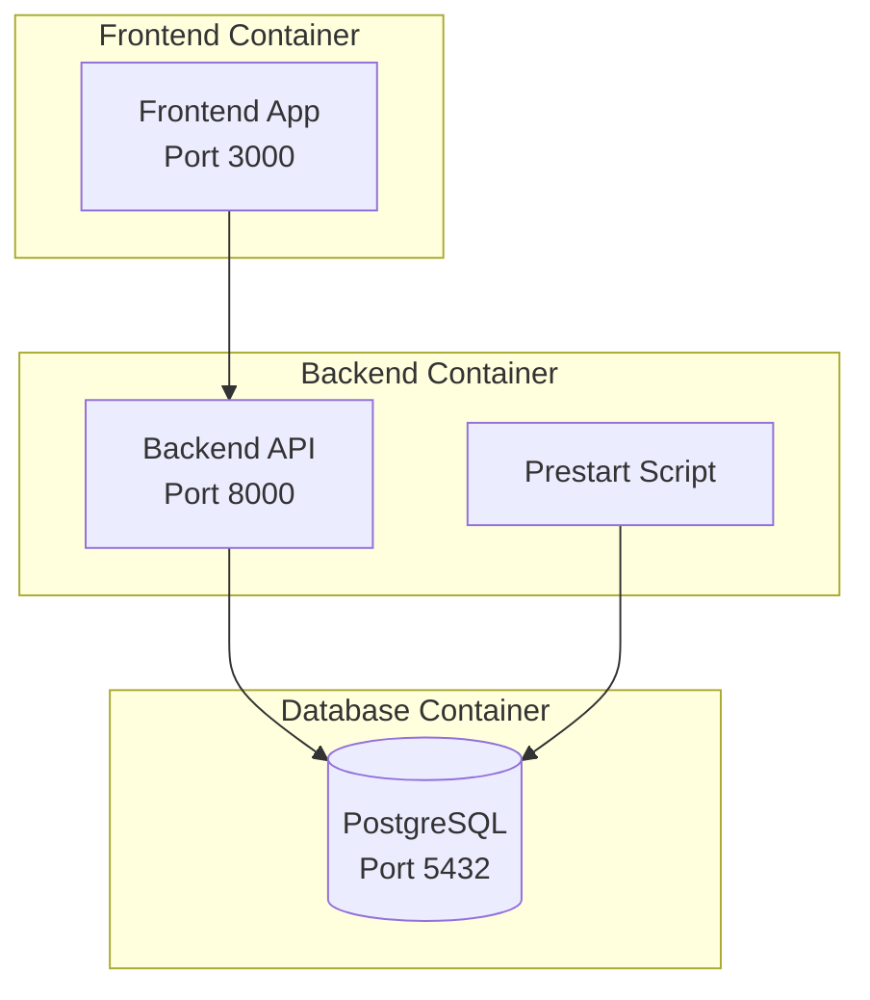

# Production Deployment Guide

## 1. Overview

This guide explains how to deploy AI-GCS-Server to a production environment. The deployment uses Docker Compose to run
frontend and backend separately.

### 1.1 Architecture



---

## 2. Prerequisites

### 2.1 System Requirements

- Docker Engine 20.10+
- Docker Compose 2.0+
- Minimum 4GB RAM
- Minimum 10GB disk space

### 2.2 Network Requirements

- Port 3000 (Frontend)
- Port 8000 (Backend)
- Port 5432 (Database, optional)

---

## 3. Environment Setup

### 3.1 Environment Variables File Creation

Create a `.env` file in the `deploy/prod/` directory and set the following variables:

```bash
DOMAIN=https://api.acslgcs.com
FRONTEND_HOST=https://acslgcs.com
ENVIRONMENT=local

PROJECT_NAME="Full Stack FastAPI Project"
STACK_NAME=full-stack-fastapi-project

# Backend
BACKEND_CORS_ORIGINS="http://localhost,http://localhost:5173"

SECRET_KEY=your-secret-key
FIRST_SUPERUSER=admin@example.com
FIRST_SUPERUSER_PASSWORD=sample_password

# Postgres
POSTGRES_SERVER=localhost
POSTGRES_PORT=5555
POSTGRES_DB=acsl_local
POSTGRES_USER=acsl_local
POSTGRES_PASSWORD=sample_password


# Configure these with your own Docker registry images
DOCKER_IMAGE_BACKEND=backend
DOCKER_IMAGE_FRONTEND=frontend


```

### 3.2 Environment Variables Description (Backend) - Modify .env file

| Variable                   | Description                | Required | Example                                    |
|----------------------------|----------------------------|----------|--------------------------------------------|
| `DOMAIN`                   | Service domain             | ✅        | `https://api.acslgcs.com`                  |
| `FRONTEND_HOST`            | Frontend URL               | ✅        | `https://acslgcs.com`                      |
| `ENVIRONMENT`              | Execution environment      | ✅        | `local` / `production`                     |
| `PROJECT_NAME`             | Project name               | ✅        | `"Full Stack FastAPI Project"`             |
| `STACK_NAME`               | Docker stack name          | ✅        | `full-stack-fastapi-project`               |
| `BACKEND_CORS_ORIGINS`     | CORS allowed domains       | ✅        | `"http://localhost,http://localhost:5173"` |
| `SECRET_KEY`               | JWT secret key             | ✅        | `your-secret-key`                          |
| `FIRST_SUPERUSER`          | Initial admin email        | ✅        | `admin@example.com`                        |
| `FIRST_SUPERUSER_PASSWORD` | Initial admin password     | ✅        | `acsl1234`                                 |
| `POSTGRES_SERVER`          | Database server            | ✅        | `localhost`                                |
| `POSTGRES_PORT`            | Database port              | ✅        | `5432`                                     |
| `POSTGRES_DB`              | Database name              | ✅        | `acsl_local`                               |
| `POSTGRES_USER`            | Database user              | ✅        | `acsl_user`                                |
| `POSTGRES_PASSWORD`        | Database password          | ✅        | `pw`                                       |
| `DOCKER_IMAGE_BACKEND`     | Backend Docker image name  | ✅        | `backend`                                  |
| `DOCKER_IMAGE_FRONTEND`    | Frontend Docker image name | ✅        | `frontend`                                 |

### 3.3 Environment Variables Description (Frontend) - Modify args directly in Docker-compose.yaml file

| Variable           | Description                    | Required | Example                   |
|--------------------|--------------------------------|----------|---------------------------|
| `VITE_API_URL`     | Backend API endpoint           | ✅        | `https://api.acslgcs.com` |
| `VITE_ENVIRONMENT` | Frontend execution environment | ✅        | `production`              |

---

## 4. Deployment Execution

### 4.1 Complete Service Deployment

```bash
# 1. Navigate to production directory
cd deploy/prod

# 2. Start backend services (including database)
sudo docker-compose -f docker-compose.backend.yaml up --build -d

# 3. Start frontend services
sudo docker-compose -f docker-compose.frontend.yaml up --build -d
```

### 4.2 Individual Service Deployment

#### Backend Only

```bash
cd deploy/prod
sudo docker-compose -f docker-compose.backend.yaml up --build -d
```

#### Frontend Only

```bash
cd deploy/prod
sudo docker-compose -f docker-compose.frontend.yaml up --build -d
```

---

This guide allows you to safely and efficiently deploy AI-GCS-Server to a production environment.