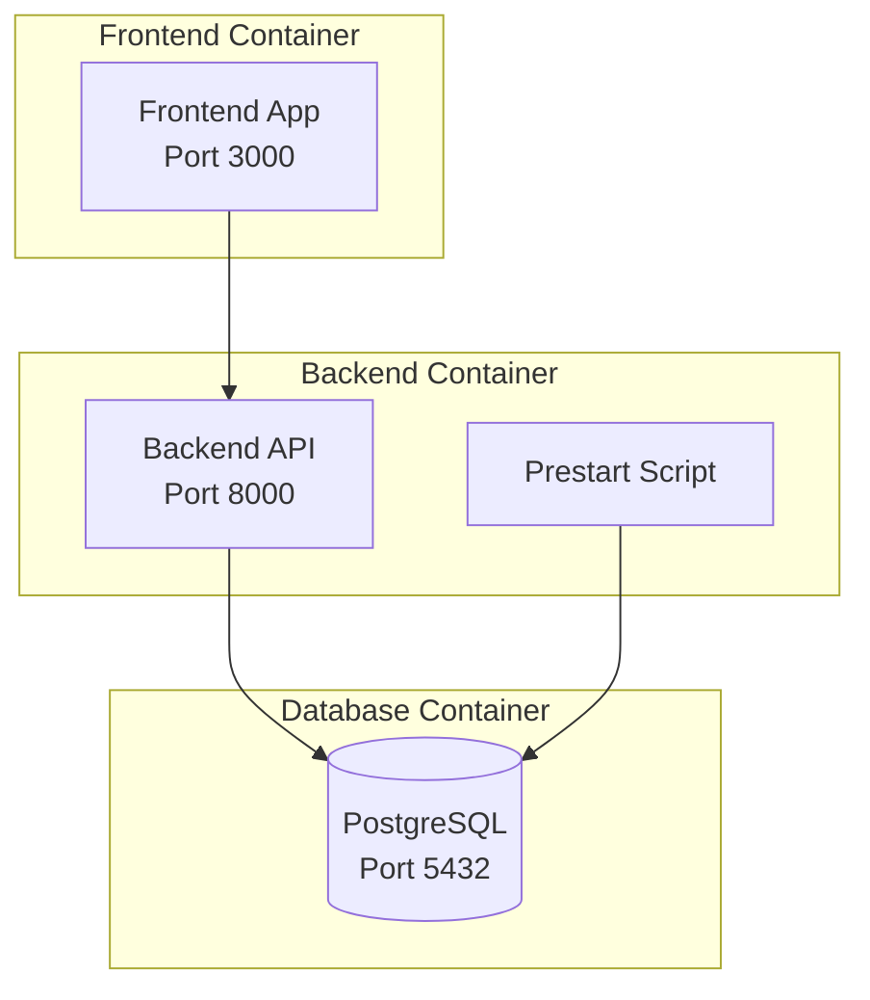

# Production Deployment Guide

## 목차
1. [개요](#1-개요)
2. [사전 요구사항](#2-사전-요구사항)
3. [환경 설정](#3-환경-설정)
4. [배포 실행](#4-배포-실행)

---

## 1. 개요

이 가이드는 AI-GCS-Server를 프로덕션 환경에 배포하는 방법을 설명합니다. 배포는 Docker Compose를 사용하여 프론트엔드와 백엔드를 분리하여 실행합니다.

### 1.1 아키텍처


```mermaid
graph TB
    subgraph "Frontend Container"
        FE[Frontend App<br/>Port 3000]
    end
    
    subgraph "Backend Container"
        BE[Backend API<br/>Port 8000]
        PS[Prestart Script]
    end
    
    subgraph "Database Container"
        DB[(PostgreSQL<br/>Port 5432)]
    end
    
    FE --> BE
    BE --> DB
    PS --> DB
```

---

## 2. 사전 요구사항

### 2.1 시스템 요구사항

- Docker Engine 20.10+
- Docker Compose 2.0+
- 최소 4GB RAM
- 최소 10GB 디스크 공간

### 2.2 네트워크 요구사항

- 포트 3000 (Frontend)
- 포트 8000 (Backend)
- 포트 5432 (Database, 선택사항)

---

## 3. 환경 설정

### 3.1 환경 변수 파일 생성

`deploy/prod/` 디렉토리에 `.env` 파일을 생성하고 다음 변수들을 설정합니다:

```bash
# Domain Configuration
DOMAIN=your-domain.com
FRONTEND_HOST=https://your-domain.com
ENVIRONMENT=production
BACKEND_CORS_ORIGINS=https://your-domain.com

# Security
SECRET_KEY=your-super-secret-key-here

# Database Configuration
POSTGRES_SERVER=db
POSTGRES_PORT=5432
POSTGRES_DB=acsl_gcs
POSTGRES_USER=acsl_user
POSTGRES_PASSWORD=your-secure-password

# Admin User
FIRST_SUPERUSER=admin@example.com
FIRST_SUPERUSER_PASSWORD=your-admin-password

# Docker Image Configuration
DOCKER_IMAGE_BACKEND=acsl-backend
TAG=latest
```

### 3.2 환경 변수 설명 (Backend) - .env파일 수정

| 변수명 | 설명 | 필수 | 예시 |
|--------|------|------|------|
| `DOMAIN` | 서비스 도메인 | ✅ | `acslgcs.com` |
| `FRONTEND_HOST` | 프론트엔드 URL | ✅ | `https://acslgcs.com` |
| `ENVIRONMENT` | 실행 환경 | ✅ | `production` |
| `BACKEND_CORS_ORIGINS` | CORS 허용 도메인 | ✅ | `https://acslgcs.com` |
| `SECRET_KEY` | JWT 시크릿 키 | ✅ | `your-secret-key` |
| `POSTGRES_DB` | 데이터베이스 이름 | ✅ | `acsl_gcs` |
| `POSTGRES_USER` | 데이터베이스 사용자 | ✅ | `acsl_user` |
| `POSTGRES_PASSWORD` | 데이터베이스 비밀번호 | ✅ | `secure-password` |
| `FIRST_SUPERUSER` | 초기 관리자 이메일 | ✅ | `admin@example.com` |
| `FIRST_SUPERUSER_PASSWORD` | 초기 관리자 비밀번호 | ✅ | `admin-password` |


### 3.2 환경 변수 설명 (Frontend) - Docker-compose.yaml 파일의 args 직접 수정 

| 변수명 | 설명 | 필수 | 예시 |
|--------|------|------|------|
| `VITE_API_URL` | 백엔드 API 엔드포인트 | ✅ | `https://api.acslgcs.com` |
| `VITE_ENVIRONMENT` | 프론트엔드 실행 환경 | ✅ | `production` |

---

## 4. 배포 실행

### 4.1 전체 서비스 배포

```bash
# 1. 프로덕션 디렉토리로 이동
cd deploy/prod

# 2. 백엔드 서비스 시작 (데이터베이스 포함)
docker-compose -f docker-compose.backend.yaml up -d

# 3. 프론트엔드 서비스 시작
docker-compose -f docker-compose.frontend.yaml up -d
```

### 4.2 개별 서비스 배포

#### 백엔드만 배포
```bash
cd deploy/prod
sudo docker-compose -f docker-compose.backend.yaml up --build -d
```

#### 프론트엔드만 배포
```bash
cd deploy/prod
sudo docker-compose -f docker-compose.frontend.yaml up --build -d
```


---

# Production Deployment Guide (English)

## Table of Contents
1. [Overview](#1-overview)
2. [Prerequisites](#2-prerequisites)
3. [Environment Setup](#3-environment-setup)
4. [Deployment Execution](#4-deployment-execution)

---

## 1. Overview

This guide explains how to deploy AI-GCS-Server to a production environment. The deployment uses Docker Compose to run frontend and backend separately.

### 1.1 Architecture


```mermaid
graph TB
    subgraph "Frontend Container"
        FE[Frontend App<br/>Port 3000]
    end
    
    subgraph "Backend Container"
        BE[Backend API<br/>Port 8000]
        PS[Prestart Script]
    end
    
    subgraph "Database Container"
        DB[(PostgreSQL<br/>Port 5432)]
    end
    
    FE --> BE
    BE --> DB
    PS --> DB
```

---

## 2. Prerequisites

### 2.1 System Requirements

- Docker Engine 20.10+
- Docker Compose 2.0+
- Minimum 4GB RAM
- Minimum 10GB disk space

### 2.2 Network Requirements

- Port 3000 (Frontend)
- Port 8000 (Backend)
- Port 5432 (Database, optional)

---

## 3. Environment Setup

### 3.1 Environment Variables File Creation

Create a `.env` file in the `deploy/prod/` directory and set the following variables:

```bash
DOMAIN=https://api.acslgcs.com
FRONTEND_HOST=https://acslgcs.com
ENVIRONMENT=local

PROJECT_NAME="Full Stack FastAPI Project"
STACK_NAME=full-stack-fastapi-project

# Backend
BACKEND_CORS_ORIGINS="http://localhost,http://localhost:5173"

SECRET_KEY=your-secret-key
FIRST_SUPERUSER=admin@example.com
FIRST_SUPERUSER_PASSWORD=ascl1234

# Postgres
POSTGRES_SERVER=localhost
POSTGRES_PORT=5555
POSTGRES_DB=ascl_local
POSTGRES_USER=chungjung
POSTGRES_PASSWORD=chungjung1234


# Configure these with your own Docker registry images
DOCKER_IMAGE_BACKEND=backend
DOCKER_IMAGE_FRONTEND=frontend


```

### 3.2 Environment Variables Description (Backend) - Modify .env file

| Variable | Description | Required | Example |
|----------|-------------|----------|---------|
| `DOMAIN` | Service domain | ✅ | `https://api.acslgcs.com` |
| `FRONTEND_HOST` | Frontend URL | ✅ | `https://acslgcs.com` |
| `ENVIRONMENT` | Execution environment | ✅ | `local` / `production` |
| `PROJECT_NAME` | Project name | ✅ | `"Full Stack FastAPI Project"` |
| `STACK_NAME` | Docker stack name | ✅ | `full-stack-fastapi-project` |
| `BACKEND_CORS_ORIGINS` | CORS allowed domains | ✅ | `"http://localhost,http://localhost:5173"` |
| `SECRET_KEY` | JWT secret key | ✅ | `your-secret-key` |
| `FIRST_SUPERUSER` | Initial admin email | ✅ | `admin@example.com` |
| `FIRST_SUPERUSER_PASSWORD` | Initial admin password | ✅ | `ascl1234` |
| `POSTGRES_SERVER` | Database server | ✅ | `localhost` |
| `POSTGRES_PORT` | Database port | ✅ | `5432` |
| `POSTGRES_DB` | Database name | ✅ | `ascl_local` |
| `POSTGRES_USER` | Database user | ✅ | `chungjung` |
| `POSTGRES_PASSWORD` | Database password | ✅ | `pw` |
| `DOCKER_IMAGE_BACKEND` | Backend Docker image name | ✅ | `backend` |
| `DOCKER_IMAGE_FRONTEND` | Frontend Docker image name | ✅ | `frontend` |

### 3.3 Environment Variables Description (Frontend) - Modify args directly in Docker-compose.yaml file

| Variable | Description | Required | Example |
|----------|-------------|----------|---------|
| `VITE_API_URL` | Backend API endpoint | ✅ | `https://api.acslgcs.com` |
| `VITE_ENVIRONMENT` | Frontend execution environment | ✅ | `production` |

---

## 4. Deployment Execution

### 4.1 Complete Service Deployment

```bash
# 1. Navigate to production directory
cd deploy/prod

# 2. Start backend services (including database)
sudo docker-compose -f docker-compose.backend.yaml up --build -d

# 3. Start frontend services
sudo docker-compose -f docker-compose.frontend.yaml up --build -d
```

### 4.2 Individual Service Deployment

#### Backend Only
```bash
cd deploy/prod
sudo docker-compose -f docker-compose.backend.yaml up --build -d
```

#### Frontend Only
```bash
cd deploy/prod
sudo docker-compose -f docker-compose.frontend.yaml up --build -d
```

---

This guide allows you to safely and efficiently deploy AI-GCS-Server to a production environment.