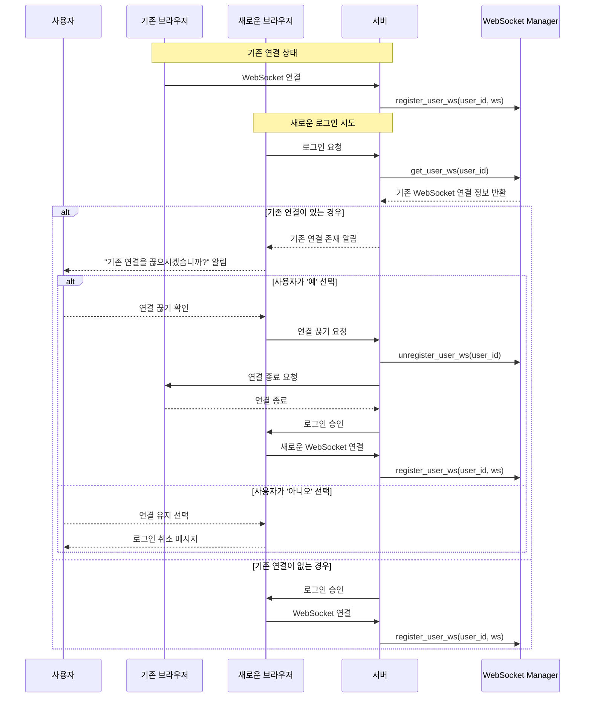

```mermaid
sequenceDiagram
    participant User as 사용자
    participant Browser1 as 기존 브라우저
    participant Browser2 as 새로운 브라우저
    participant Server as 서버
    participant WSManager as WebSocket Manager

    Note over Browser1,Server: 기존 연결 상태
    Browser1->>Server: WebSocket 연결
    Server->>WSManager: register_user_ws(user_id, ws)

    Note over Browser2,Server: 새로운 로그인 시도
    Browser2->>Server: 로그인 요청
    Server->>WSManager: get_user_ws(user_id)
    WSManager-->>Server: 기존 WebSocket 연결 정보 반환
    
    alt 기존 연결이 있는 경우
        Server-->>Browser2: 기존 연결 존재 알림
        Browser2-->>User: "기존 연결을 끊으시겠습니까?" 알림
        
        alt 사용자가 '예' 선택
            User-->>Browser2: 연결 끊기 확인
            Browser2->>Server: 연결 끊기 요청
            Server->>WSManager: unregister_user_ws(user_id)
            Server->>Browser1: 연결 종료 요청
            Browser1-->>Server: 연결 종료
            Server->>Browser2: 로그인 승인
            Browser2->>Server: 새로운 WebSocket 연결
            Server->>WSManager: register_user_ws(user_id, ws)
            
        else 사용자가 '아니오' 선택
            User-->>Browser2: 연결 유지 선택
            Browser2-->>User: 로그인 취소 메시지
        end
        
    else 기존 연결이 없는 경우
        Server->>Browser2: 로그인 승인
        Browser2->>Server: WebSocket 연결
        Server->>WSManager: register_user_ws(user_id, ws)
    end
``` 