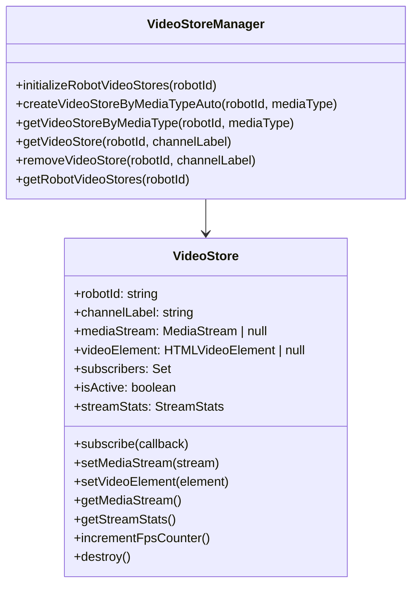
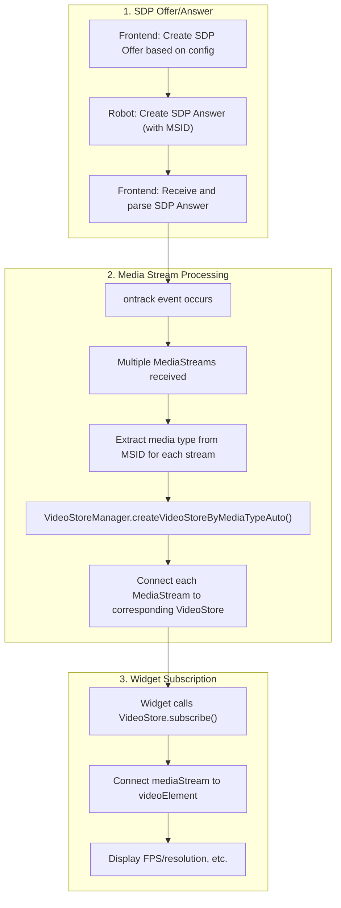
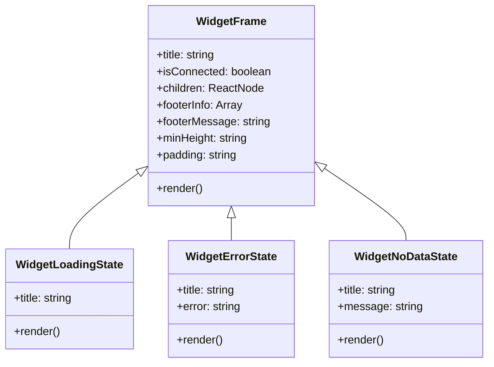

# Media Stream Setup and Management Guide

### Table of Contents
1. [Video Store Structure](#1-video-store-structure)
2. [Video Store Internal Processing and Robot Metadata](#2-video-store-internal-processing-and-robot-metadata)
3. [Widget Modularization Structure](#3-widget-modularization-structure)
4. [Adding New Video Tracks](#4-adding-new-video-tracks)

---

### 1. Video Store Structure

#### 1.1 Concept and Role
- The Video Store delivers WebRTC MediaStream to subscribers (such as widgets) in real time.
- It does not store data; it simply connects and delivers incoming streams.

#### 1.2 Class Structure (Example)


#### 1.3 Main Components
- **VideoStore**: Delivers MediaStream, measures FPS, manages statistics
- **VideoStoreManager**: Singleton, manages stores by media type, auto-creates/cleans up

---

### 2. Video Store Internal Processing and Robot Metadata

#### 2.1 Overall Data Flow


#### 2.2 MSID-based Media Type Parsing
- In the SDP Answer, the `a=msid-semantic: WMS ...` line lists media types in a single line, separated by spaces.
- Example:
  ```
  a=msid-semantic: WMS turtlesim_video go2_camera ouster_lidar
  ```
- Each media stream is specified as `a=msid:{media_type} {uuid}`.

#### 2.3 Frontend Parsing Example
```typescript
// webrtc-sdp-utils.ts
export function parseMetadataFromSdp(sdp: string): Map<string, any> {
  const metadata = new Map<string, any>();
  const normalizedSdp = sdp.replace(/\r\n/g, '\n').replace(/\r/g, '\n');
  const lines = normalizedSdp.split('\n');
  
  // Parse all media types from MSID semantic
  for (const line of lines) {
    const msidSemanticMatch = line.match(/^a=msid-semantic:\s+WMS\s+(.+)$/);
    if (msidSemanticMatch) {
      const mediaTypes = msidSemanticMatch[1].trim().split(' ');
      metadata.set('mediaTypes', mediaTypes);
      break;
    }
  }
  
  // Parse MSID for each media stream
  const mediaStreams: Array<{mediaType: string, streamId: string}> = [];
  for (const line of lines) {
    const msidMatch = line.match(/^a=msid:\s*([^\s]+)\s+([^\s]+)$/);
    if (msidMatch) {
      const mediaType = msidMatch[1].trim();
      const streamId = msidMatch[2].trim();
      mediaStreams.push({ mediaType, streamId });
    }
  }
  
  metadata.set('mediaStreams', mediaStreams);
  return metadata;
}
```

#### 2.4 Multiple Media Streams Processing Example
```typescript
// webrtc-connection.ts
this.peerConnection.ontrack = (event) => {
  if (event.track.kind === 'video') {
    // Process all media streams
    event.streams.forEach((stream, index) => {
      // Extract media type from MSID for this stream
      const mediaType = this.getMediaTypeFromStream(stream, metadata);
      
      if (mediaType && MediaChannelConfigUtils.isSupportedMediaType(mediaType)) {
        const videoStoreManager = VideoStoreManager.getInstance();
        const videoStore = videoStoreManager.createVideoStoreByMediaTypeAuto(
          this.config.robotId, 
          mediaType
        );
        
        if (videoStore) {
          videoStore.setMediaStream(stream);
          console.log(`Video Store connected: ${mediaType} for robot ${this.config.robotId}`);
        }
      }
    });
  }
};
```

---

### 3. Widget Modularization Structure

#### 3.1 WidgetFrame Component
All widgets use the `WidgetFrame` component to provide consistent UI/UX.



#### 3.2 Widget Structure Example
```typescript
// New widget creation example
export function NewVideoWidget({ robotId, store, dataType }: NewVideoWidgetProps) {
  const [isConnected, setIsConnected] = useState(false);
  const [videoData, setVideoData] = useState(null);

  // Configure footer info
  const footerInfo = [
    {
      label: 'FPS',
      value: `${videoData?.stats.fps || 0} fps`
    },
    {
      label: 'Resolution',
      value: videoData?.stats.width && videoData?.stats.height 
        ? `${videoData.stats.width}x${videoData.stats.height}`
        : 'Unknown'
    }
  ];

  return (
    <WidgetFrame
      title="New Video Widget"
      isConnected={isConnected}
      footerInfo={footerInfo}
      footerMessage={isConnected ? 'Video stream active' : 'Waiting for stream...'}
    >
      {/* Widget-specific content */}
      <video
        ref={videoRef}
        style={{
          width: '100%',
          height: '100%',
          objectFit: 'contain'
        }}
        playsInline
        muted
        autoPlay
      />
    </WidgetFrame>
  );
}
```

#### 3.3 Widget File Structure
```
frontend/src/components/Dashboard/widgets/
├── WidgetFrame.tsx              # Common widget frame
├── types.ts                     # Widget type definitions
├── WidgetFactory.tsx            # Widget factory
├── TurtlesimVideoWidget.tsx     # Video widget (uses WidgetFrame)
├── TurtlesimPositionWidget.tsx  # Position widget (uses WidgetFrame)
├── Go2LowStateWidget.tsx        # State widget (uses WidgetFrame)
└── ...
```

---

### 4. Adding New Video Tracks

#### 4.1 Add Media Channel Configuration
- Add a new media type to `frontend/src/rtc/webrtc-media-channel-config.ts`
```typescript
export const MEDIA_CHANNEL_CONFIG = {
  'turtlesim_video': { ... },
  'new_video': {
    type: 'new_video',
    channelType: 'readonly' as const,
    defaultLabel: 'new_video'
  }
} as const;
```

#### 4.2 Create VideoStore Class
- Create `frontend/src/dashboard/store/media-channel-store/new-video.store.ts`
- Inherit from VideoStore and override necessary methods

#### 4.3 Register Factory in VideoStoreManager
- Register in `storeFactories` in `video-store-manager.ts`

#### 4.4 Create and Register Widget
1. **Create Widget Component**: `NewVideoWidget.tsx`
   ```typescript
   import { WidgetFrame } from './WidgetFrame';
   
   export function NewVideoWidget({ robotId, store, dataType }: NewVideoWidgetProps) {
     // Use WidgetFrame to provide consistent UI
     return (
       <WidgetFrame
         title="New Video"
         isConnected={isConnected}
         footerInfo={footerInfo}
         footerMessage={footerMessage}
       >
         {/* Widget-specific content */}
       </WidgetFrame>
     );
   }
   ```

2. **Register Type**: `types.ts`
   ```typescript
   export type WidgetType = 'go2_low_state' | 'go2_ouster_pointcloud' | 'turtlesim_position' | 'turtlesim_remote_control' | 'new_video';
   ```

3. **Register Factory**: `WidgetFactory.tsx`
   ```typescript
   case 'new_video':
     const newVideoStore = videoStoreManager.createVideoStoreByMediaTypeAuto(
       robotId,
       'new_video'
     );
     return <NewVideoWidget robotId={robotId} store={newVideoStore} dataType={dataType} />;
   ```

4. **Register in Modal**: `AddWidgetModal.tsx`
   ```typescript
   const widgetOptions = [
     { value: 'turtlesim_video', label: 'Turtlesim Video' },
     { value: 'new_video', label: 'New Video' }
   ];
   ```

#### 4.5 Add Media Type to Robot SDP Answer
- Example:
  ```
  a=msid-semantic: WMS turtlesim_video new_video
  a=msid:turtlesim_video ef34ef46-a528-4d61-b197-81cf0a97aae4
  a=msid:new_video 8caa385d-58ef-4a3e-86c9-a5cacf1466b9
  ```