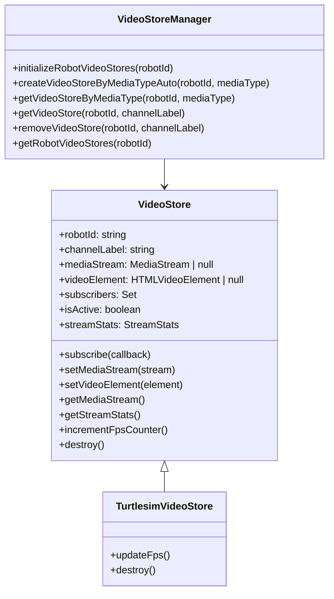
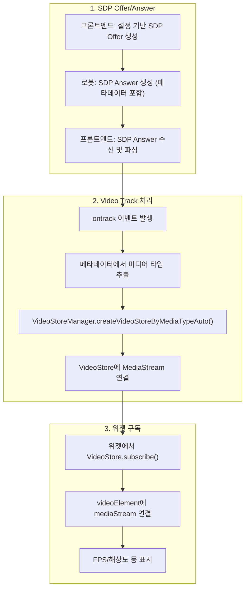
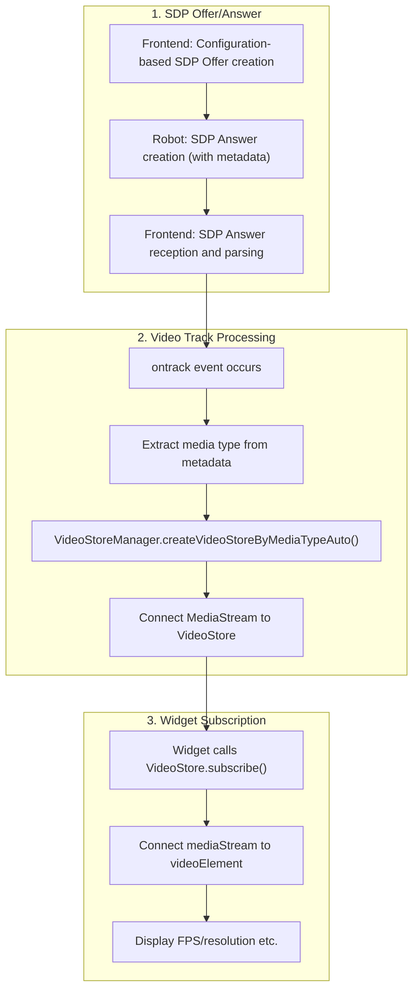

# Media stream Setup and Management Guide

## 한국어 (Korean)

### 목차
1. [Video Store 구조](#1-video-store-구조)
2. [Video Store 내부 처리 및 로봇 메타데이터](#2-video-store-내부-처리-및-로봇-메타데이터)
3. [새로운 비디오 트랙 추가 방법](#3-새로운-비디오-트랙-추가-방법)

---

### 1. Video Store 구조

#### 1.1 핵심 개념

Video Store는 **WebRTC MediaStream을 구독자에게 실시간으로 전달하는 역할**만 수행합니다.

| 구분 | Data Store | Video Store |
|------|------------|-------------|
| **데이터 저장** | 프레임/데이터 배열 | 프레임 저장 없음 |
| **역할** | 데이터 수집/관리 | 실시간 스트림 전달자 |
| **메모리 사용** | 누적 데이터로 증가 | 최소 메모리 |
| **구독자 처리** | 저장 데이터 전달 | 실시간 스트림 즉시 전달 |
| **라이프사이클** | 수집→저장→알림 | 수신→즉시 전달 |

#### 1.2 클래스 구조



#### 1.3 주요 컴포넌트 설명

- **VideoStore**: MediaStream을 구독자에게 전달, FPS 측정, 통계 관리
- **TurtlesimVideoStore**: VideoStore 확장, 기본 비디오 스트림 처리
- **VideoStoreManager**: 싱글턴, 심볼 기반 store 관리, 미디어 타입별 팩토리, 자동 생성/정리

---

### 2. Video Store 내부 처리 및 로봇 메타데이터

#### 2.1 전체 데이터 플로우



#### 2.2 동적 비디오 트랙 관리

프론트엔드는 **설정 기반으로 동적으로 비디오 트랙을 요청**합니다:

```typescript
// webrtc-media-channel-config.ts에서 설정된 미디어 타입들
export const MEDIA_CHANNEL_CONFIG = {
  'turtlesim_video': {
    type: 'turtlesim_video',
    channelType: 'readonly' as const,
    defaultLabel: 'turtlesim_video_track',
    description: 'Turtlesim Video Stream'
  }
} as const

// 설정된 미디어 타입 개수만큼 비디오 트랜시버 생성
const activeMediaChannels = MediaChannelConfigUtils.getActiveMediaChannels()
// 결과: ['turtlesim_video']

// 각 미디어 타입마다 비디오 트랜시버 추가
activeMediaChannels.forEach((mediaType, index) => {
  peerConnection.addTransceiver('video', { direction: 'recvonly' })
})
```

#### 2.3 로봇 쪽 SDP Answer 형식

로봇/서버에서 SDP Answer를 생성할 때는 **반드시 아래 형식**으로 메타데이터를 삽입해야 합니다:

##### SDP Answer 예시
```sdp
v=0
o=- 1234567890 2 IN IP4 127.0.0.1
s=-
t=0 0
a=group:BUNDLE 0
m=video 9 UDP/TLS/RTP/SAVPF 96
c=IN IP4 0.0.0.0
a=mid:0
a=sendonly
a=media-type:turtlesim_video
a=track-description:Turtlesim Video Stream
a=track-quality:640x480@30fps
a=track-source:turtlesim_node
a=track-index:0
a=rtpmap:96 H264/90000
a=fmtp:96 level-asymmetry-allowed=1;packetization-mode=1;profile-level-id=42001f
```

##### 필수 메타데이터 필드

| 필드 | 형식 | 예시 | 설명 |
|------|------|------|------|
| `a=media-type:` | `a=media-type:{미디어타입}` | `a=media-type:turtlesim_video` | 지원되는 미디어 타입 |
| `a=track-description:` | `a=track-description:{설명}` | `a=track-description:Turtlesim Video Stream` | 트랙에 대한 설명 |
| `a=track-quality:` | `a=track-quality:{해상도}@{프레임레이트}fps` | `a=track-quality:640x480@30fps` | 비디오 품질 정보 |
| `a=track-source:` | `a=track-source:{소스}` | `a=track-source:turtlesim_node` | 비디오 소스 정보 |
| `a=track-index:` | `a=track-index:{숫자}` | `a=track-index:0` | 트랙 인덱스 (0부터 시작) |

#### 2.4 프론트엔드 내부 처리 과정

##### 1) SDP Answer 파싱
```typescript
// webrtc-sdp-utils.ts
export function parseMetadataFromSdp(sdp: string): Map<string, any> {
  const metadata = new Map<string, any>();
  const lines = sdp.split('\n');
  
  for (const line of lines) {
    const mediaTypeMatch = line.match(/^a=media-type:(.+)$/);
    if (mediaTypeMatch) {
      metadata.set('mediaType', mediaTypeMatch[1].trim());
    }
    // ... 다른 필드들도 정규식으로 파싱
  }
  
  return metadata;
}
```

##### 2) Video Track 핸들러 설정
```typescript
// webrtc-connection.ts
private setupVideoTrackHandler(metadata: Map<string, any>): void {
  this.peerConnection.ontrack = (event) => {
    if (event.track.kind === 'video' && event.streams && event.streams[0]) {
      const stream = event.streams[0];
      
      // 메타데이터에서 미디어 타입 결정
      const mediaType = metadata.get('mediaType') || 'turtlesim_video';
      
      // 미디어 타입이 지원되는지 확인
      if (MediaChannelConfigUtils.isSupportedMediaType(mediaType)) {
        // VideoStore 생성 및 연결
        const videoStore = videoStoreManager.createVideoStoreByMediaTypeAuto(
          this.config.robotId, 
          mediaType
        );
        
        if (videoStore) {
          videoStore.setMetadata(metadata);
          videoStore.setMediaStream(stream);
        }
      }
    }
  };
}
```

##### 3) VideoStore 생성
```typescript
// video-store-manager.ts
public createVideoStoreByMediaTypeAuto(robotId: string, mediaType: string): VideoStore | null {
  // 미디어 타입이 지원되는지 확인
  if (!MediaChannelConfigUtils.isSupportedMediaType(mediaType)) {
    console.warn(`지원되지 않는 미디어 타입: ${mediaType}`);
    return null;
  }
  
  // 미디어 타입별 스토어 팩토리 매핑
  const storeFactories: Record<string, (robotId: string, channelLabel: string) => VideoStore> = {
    'turtlesim_video': (robotId: string, channelLabel: string) => new TurtlesimVideoStore(robotId, channelLabel),
  };
  
  const storeFactory = storeFactories[mediaType];
  if (!storeFactory) {
    console.warn(`미디어 타입 ${mediaType}에 대한 스토어 팩토리가 없음`);
    return null;
  }
  
  return this.createVideoStoreByMediaType(robotId, mediaType, storeType, storeFactory);
}
```

---

### 3. 새로운 비디오 트랙 추가 방법

새로운 비디오 트랙을 추가하려면 **3개의 파일을 수정**해야 합니다:

#### 3.1 1단계: Media Channel 설정 추가

**파일**: `frontend/src/rtc/webrtc-media-channel-config.ts`

```typescript
// 미디어 타입별 설정에 새로운 타입 추가
export const MEDIA_CHANNEL_CONFIG = {
  'turtlesim_video': {
    type: 'turtlesim_video',
    channelType: 'readonly' as const,
    defaultLabel: 'turtlesim_video_track',
    description: 'Turtlesim Video Stream'
  },
  // 새로운 미디어 타입 추가
  'new_video': {
    type: 'new_video',
    channelType: 'readonly' as const,
    defaultLabel: 'new_video_track',
    description: 'New Video Stream'
  }
} as const;

// 심볼 매핑에도 추가
export const MEDIA_TYPE_SYMBOLS = {
  'turtlesim_video': Symbol('turtlesim_video'),
  'new_video': Symbol('new_video')  // 추가
} as const;
```

**자동으로 2개의 비디오 트랜시버가 생성됩니다!**

#### 3.2 2단계: VideoStore 클래스 생성

**파일**: `frontend/src/dashboard/store/media-channel-store/new-video.store.ts` (새 파일)

```typescript
import { VideoStore, VideoData } from "./video-store"

export class NewVideoStore extends VideoStore {
    constructor(robotId: string, channelLabel: string) {
        super(robotId, channelLabel)
    }

    // Override FPS update
    protected updateFps(): void {
        const videoElement = this.getVideoElement()
        const mediaStream = this.getMediaStream()
        
        if (!videoElement || !mediaStream) return

        const fps = this.getFpsCounter()
        this.setFpsCounter(0)
        
        // Update stream statistics
        const currentStats = this.getStreamStatsInternal()
        const newStats = {
            ...currentStats,
            fps: fps,
            width: videoElement.videoWidth || 640,
            height: videoElement.videoHeight || 480
        }
        this.setStreamStats(newStats)
        
        // Create video data
        const videoData: VideoData = {
            streamId: mediaStream.id,
            robotId: this.getRobotId(),
            channelLabel: this.getChannelLabel(),
            mediaStream: mediaStream,
            isActive: this.getIsActive(),
            stats: newStats,
            timestamp: Date.now(),
            metadata: this.getMetadata()
        }
        
        // Notify subscribers
        this.notifySubscribers(videoData)
    }

    // Notify subscribers
    private notifySubscribers(videoData: VideoData): void {
        const subscribers = this.getSubscribers()
        subscribers.forEach((callback: any) => {
            try {
                callback(videoData)
            } catch (error) {
                console.error(`NewVideoStore[${this.getChannelLabel()}] subscriber callback error:`, error)
            }
        })
    }

    // Cleanup method
    public destroy(): void {
        super.destroy()
    }
}
```

#### 3.3 3단계: VideoStoreManager에 팩토리 추가

**파일**: `frontend/src/dashboard/store/media-channel-store/video-store-manager.ts`

```typescript
import { NewVideoStore } from "./new-video.store"  // Add this

// Add to storeFactories in createVideoStoreByMediaTypeAuto method
const storeFactories: Record<string, (robotId: string, channelLabel: string) => VideoStore> = {
  'turtlesim_video': (robotId: string, channelLabel: string) => new TurtlesimVideoStore(robotId, channelLabel),
  'new_video': (robotId: string, channelLabel: string) => new NewVideoStore(robotId, channelLabel),  // Add this
}
```

#### 3.4 4단계: 위젯 생성

**파일**: `frontend/src/components/Dashboard/widgets/NewVideoWidget.tsx` (new file)

```typescript
import React, { useEffect, useRef, useState } from 'react'
import { VideoData } from '../../../dashboard/store/media-channel-store/video-store'

interface NewVideoWidgetProps {
    robotId: string
    channelLabel: string
    videoData?: VideoData
}

export const NewVideoWidget: React.FC<NewVideoWidgetProps> = ({
    robotId,
    channelLabel,
    videoData
}) => {
    const videoRef = useRef<HTMLVideoElement>(null)
    const [isActive, setIsActive] = useState(false)
    const [fps, setFps] = useState(0)
    const [resolution, setResolution] = useState('0x0')
    const [metadata, setMetadata] = useState<string>('')

    useEffect(() => {
        if (!videoData) return

        const { mediaStream, isActive, stats, metadata: meta } = videoData

        // Set media stream to video element
        if (videoRef.current && mediaStream) {
            videoRef.current.srcObject = mediaStream
        }

        // Update state
        setIsActive(isActive)
        setFps(stats.fps || 0)
        setResolution(`${stats.width || 0}x${stats.height || 0}`)
        
        // Convert metadata to string
        if (meta && typeof meta === 'object') {
            const metaStr = Object.entries(meta)
                .filter(([_, value]) => value !== undefined)
                .map(([key, value]) => `${key}: ${value}`)
                .join(', ')
            setMetadata(metaStr)
        } else {
            setMetadata(meta || '')
        }
    }, [videoData])

    return (
        <div className="relative bg-black rounded-lg overflow-hidden">
            {/* Video player */}
            <video
                ref={videoRef}
                autoPlay
                playsInline
                muted
                className="w-full h-full object-contain"
            />
            
            {/* Overlay information */}
            <div className="absolute top-2 left-2 bg-black bg-opacity-70 text-white text-xs p-2 rounded">
                <div>Robot: {robotId}</div>
                <div>Channel: {channelLabel}</div>
                <div>Status: {isActive ? 'Active' : 'Inactive'}</div>
                <div>FPS: {fps}</div>
                <div>Resolution: {resolution}</div>
                {metadata && <div>Metadata: {metadata}</div>}
            </div>
        </div>
    )
}
```

#### 3.5 Step 5: Modify Robot SDP Answer

Generate SDP Answer with new media type on robot side:

```sdp
a=media-type:new_video
a=track-description:New Video Stream
a=track-quality:640x480@30fps
a=track-source:new_source
a=track-index:0
```
#### 3.6 마무리

새로운 `new_video` 비디오 트랙이 완전히 구성되었습니다.

**중요**: `MEDIA_CHANNEL_CONFIG`에 `new_video`를 추가하면 자동으로:
1. **2개의 비디오 트랜시버**가 생성됩니다 (`turtlesim_video` + `new_video`)
2. SDP Offer에서 **2개의 비디오 트랙**이 요청됩니다
3. 로봇이 해당 메타데이터와 함께 SDP Answer를 보내면, NewVideoStore가 자동으로 생성되어 NewVideoWidget에 표시됩니다

---

## English

### Table of Contents
1. [Video Store Structure](#1-video-store-structure)
2. [Video Store Internal Processing and Robot Metadata](#2-video-store-internal-processing-and-robot-metadata)
3. [Adding New Video Tracks](#3-adding-new-video-tracks)

---

### 1. Video Store Structure

#### 1.1 Core Concepts

Video Store only performs the role of **delivering WebRTC MediaStream to subscribers in real-time**.

| Aspect | Data Store | Video Store |
|--------|------------|-------------|
| **Data Storage** | Frame/data arrays | No frame storage |
| **Role** | Data collection/management | Real-time stream delivery |
| **Memory Usage** | Increases with accumulated data | Minimal memory |
| **Subscriber Processing** | Deliver stored data | Deliver real-time stream immediately |
| **Lifecycle** | Collect→Store→Notify | Receive→Deliver immediately |

#### 1.2 Class Structure


#### 1.3 Main Components

- **VideoStore**: Delivers MediaStream to subscribers, measures FPS, manages statistics
- **TurtlesimVideoStore**: Extends VideoStore, basic video stream processing
- **VideoStoreManager**: Singleton, symbol-based store management, media type factory, automatic creation/cleanup

---

### 2. Video Store Internal Processing and Robot Metadata

#### 2.1 Complete Data Flow



#### 2.2 Dynamic Video Track Management

The frontend **dynamically requests video tracks based on configuration**:

```typescript
// Media types configured in webrtc-media-channel-config.ts
export const MEDIA_CHANNEL_CONFIG = {
  'turtlesim_video': {
    type: 'turtlesim_video',
    channelType: 'readonly' as const,
    defaultLabel: 'turtlesim_video_track',
    description: 'Turtlesim Video Stream'
  }
} as const

// Create video transceivers based on configured media types
const activeMediaChannels = MediaChannelConfigUtils.getActiveMediaChannels()
// Result: ['turtlesim_video']

// Add video transceiver for each media type
activeMediaChannels.forEach((mediaType, index) => {
  peerConnection.addTransceiver('video', { direction: 'recvonly' })
})
```

#### 2.3 Robot SDP Answer Format

When creating SDP Answer on the robot/server side, **metadata must be inserted in the following format**:

##### SDP Answer Example
```sdp
v=0
o=- 1234567890 2 IN IP4 127.0.0.1
s=-
t=0 0
a=group:BUNDLE 0
m=video 9 UDP/TLS/RTP/SAVPF 96
c=IN IP4 0.0.0.0
a=mid:0
a=sendonly
a=media-type:turtlesim_video
a=track-description:Turtlesim Video Stream
a=track-quality:640x480@30fps
a=track-source:turtlesim_node
a=track-index:0
a=rtpmap:96 H264/90000
a=fmtp:96 level-asymmetry-allowed=1;packetization-mode=1;profile-level-id=42001f
```

##### Required Metadata Fields

| Field | Format | Example | Description |
|-------|--------|---------|-------------|
| `a=media-type:` | `a=media-type:{mediatype}` | `a=media-type:turtlesim_video` | Supported media type |
| `a=track-description:` | `a=track-description:{description}` | `a=track-description:Turtlesim Video Stream` | Track description |
| `a=track-quality:` | `a=track-quality:{resolution}@{framerate}fps` | `a=track-quality:640x480@30fps` | Video quality information |
| `a=track-source:` | `a=track-source:{source}` | `a=track-source:turtlesim_node` | Video source information |
| `a=track-index:` | `a=track-index:{number}` | `a=track-index:0` | Track index (starting from 0) |

#### 2.4 Frontend Internal Processing

##### 1) SDP Answer Parsing
```typescript
// webrtc-sdp-utils.ts
export function parseMetadataFromSdp(sdp: string): Map<string, any> {
  const metadata = new Map<string, any>();
  const lines = sdp.split('\n');
  
  for (const line of lines) {
    const mediaTypeMatch = line.match(/^a=media-type:(.+)$/);
    if (mediaTypeMatch) {
      metadata.set('mediaType', mediaTypeMatch[1].trim());
    }
    // ... parse other fields with regex
  }
  
  return metadata;
}
```

##### 2) Video Track Handler Setup
```typescript
// webrtc-connection.ts
private setupVideoTrackHandler(metadata: Map<string, any>): void {
  this.peerConnection.ontrack = (event) => {
    if (event.track.kind === 'video' && event.streams && event.streams[0]) {
      const stream = event.streams[0];
      
      // Determine media type from metadata
      const mediaType = metadata.get('mediaType') || 'turtlesim_video';
      
      // Check if media type is supported
      if (MediaChannelConfigUtils.isSupportedMediaType(mediaType)) {
        // Create and connect VideoStore
        const videoStore = videoStoreManager.createVideoStoreByMediaTypeAuto(
          this.config.robotId, 
          mediaType
        );
        
        if (videoStore) {
          videoStore.setMetadata(metadata);
          videoStore.setMediaStream(stream);
        }
      }
    }
  };
}
```

##### 3) VideoStore Creation
```typescript
// video-store-manager.ts
public createVideoStoreByMediaTypeAuto(robotId: string, mediaType: string): VideoStore | null {
  // Check if media type is supported
  if (!MediaChannelConfigUtils.isSupportedMediaType(mediaType)) {
    console.warn(`Unsupported media type: ${mediaType}`);
    return null;
  }
  
  // Media type to store factory mapping
  const storeFactories: Record<string, (robotId: string, channelLabel: string) => VideoStore> = {
    'turtlesim_video': (robotId: string, channelLabel: string) => new TurtlesimVideoStore(robotId, channelLabel),
  };
  
  const storeFactory = storeFactories[mediaType];
  if (!storeFactory) {
    console.warn(`No store factory for media type ${mediaType}`);
    return null;
  }
  
  return this.createVideoStoreByMediaType(robotId, mediaType, storeType, storeFactory);
}
```

---

### 3. Adding New Video Tracks

To add a new video track, you need to **modify 3 files**:

#### 3.1 Step 1: Add Media Channel Configuration

**File**: `frontend/src/rtc/webrtc-media-channel-config.ts`

```typescript
// Add new media type to configuration
export const MEDIA_CHANNEL_CONFIG = {
  'turtlesim_video': {
    type: 'turtlesim_video',
    channelType: 'readonly' as const,
    defaultLabel: 'turtlesim_video_track',
    description: 'Turtlesim Video Stream'
  },
  // Add new media type
  'new_video': {
    type: 'new_video',
    channelType: 'readonly' as const,
    defaultLabel: 'new_video_track',
    description: 'New Video Stream'
  }
} as const;

// Add to symbol mapping
export const MEDIA_TYPE_SYMBOLS = {
  'turtlesim_video': Symbol('turtlesim_video'),
  'new_video': Symbol('new_video')  // Add this
} as const;
```

**2 video transceivers will be created automatically!**

#### 3.2 Step 2: Create VideoStore Class

**File**: `frontend/src/dashboard/store/media-channel-store/new-video.store.ts` (new file)

```typescript
import { VideoStore, VideoData } from "./video-store"

export class NewVideoStore extends VideoStore {
    constructor(robotId: string, channelLabel: string) {
        super(robotId, channelLabel)
    }

    // Override FPS update
    protected updateFps(): void {
        const videoElement = this.getVideoElement()
        const mediaStream = this.getMediaStream()
        
        if (!videoElement || !mediaStream) return

        const fps = this.getFpsCounter()
        this.setFpsCounter(0)
        
        // Update stream statistics
        const currentStats = this.getStreamStatsInternal()
        const newStats = {
            ...currentStats,
            fps: fps,
            width: videoElement.videoWidth || 640,
            height: videoElement.videoHeight || 480
        }
        this.setStreamStats(newStats)
        
        // Create video data
        const videoData: VideoData = {
            streamId: mediaStream.id,
            robotId: this.getRobotId(),
            channelLabel: this.getChannelLabel(),
            mediaStream: mediaStream,
            isActive: this.getIsActive(),
            stats: newStats,
            timestamp: Date.now(),
            metadata: this.getMetadata()
        }
        
        // Notify subscribers
        this.notifySubscribers(videoData)
    }

    // Notify subscribers
    private notifySubscribers(videoData: VideoData): void {
        const subscribers = this.getSubscribers()
        subscribers.forEach((callback: any) => {
            try {
                callback(videoData)
            } catch (error) {
                console.error(`NewVideoStore[${this.getChannelLabel()}] subscriber callback error:`, error)
            }
        })
    }

    // Cleanup method
    public destroy(): void {
        super.destroy()
    }
}
```

#### 3.3 Step 3: Add Factory to VideoStoreManager

**File**: `frontend/src/dashboard/store/media-channel-store/video-store-manager.ts`

```typescript
import { NewVideoStore } from "./new-video.store"  // Add this

// Add to storeFactories in createVideoStoreByMediaTypeAuto method
const storeFactories: Record<string, (robotId: string, channelLabel: string) => VideoStore> = {
  'turtlesim_video': (robotId: string, channelLabel: string) => new TurtlesimVideoStore(robotId, channelLabel),
  'new_video': (robotId: string, channelLabel: string) => new NewVideoStore(robotId, channelLabel),  // Add this
}
```

#### 3.4 Step 4: Create Widget

**File**: `frontend/src/components/Dashboard/widgets/NewVideoWidget.tsx` (new file)

```typescript
import React, { useEffect, useRef, useState } from 'react'
import { VideoData } from '../../../dashboard/store/media-channel-store/video-store'

interface NewVideoWidgetProps {
    robotId: string
    channelLabel: string
    videoData?: VideoData
}

export const NewVideoWidget: React.FC<NewVideoWidgetProps> = ({
    robotId,
    channelLabel,
    videoData
}) => {
    const videoRef = useRef<HTMLVideoElement>(null)
    const [isActive, setIsActive] = useState(false)
    const [fps, setFps] = useState(0)
    const [resolution, setResolution] = useState('0x0')
    const [metadata, setMetadata] = useState<string>('')

    useEffect(() => {
        if (!videoData) return

        const { mediaStream, isActive, stats, metadata: meta } = videoData

        // Set media stream to video element
        if (videoRef.current && mediaStream) {
            videoRef.current.srcObject = mediaStream
        }

        // Update state
        setIsActive(isActive)
        setFps(stats.fps || 0)
        setResolution(`${stats.width || 0}x${stats.height || 0}`)
        
        // Convert metadata to string
        if (meta && typeof meta === 'object') {
            const metaStr = Object.entries(meta)
                .filter(([_, value]) => value !== undefined)
                .map(([key, value]) => `${key}: ${value}`)
                .join(', ')
            setMetadata(metaStr)
        } else {
            setMetadata(meta || '')
        }
    }, [videoData])

    return (
        <div className="relative bg-black rounded-lg overflow-hidden">
            {/* Video player */}
            <video
                ref={videoRef}
                autoPlay
                playsInline
                muted
                className="w-full h-full object-contain"
            />
            
            {/* Overlay information */}
            <div className="absolute top-2 left-2 bg-black bg-opacity-70 text-white text-xs p-2 rounded">
                <div>Robot: {robotId}</div>
                <div>Channel: {channelLabel}</div>
                <div>Status: {isActive ? 'Active' : 'Inactive'}</div>
                <div>FPS: {fps}</div>
                <div>Resolution: {resolution}</div>
                {metadata && <div>Metadata: {metadata}</div>}
            </div>
        </div>
    )
}
```

#### 3.5 Step 5: Modify Robot SDP Answer

Generate SDP Answer with new media type on robot side:

```sdp
a=media-type:new_video
a=track-description:New Video Stream
a=track-quality:640x480@30fps
a=track-source:new_source
a=track-index:0
```

#### 3.6 Completion

The new `new_video` video track is now fully configured.

**Important**: Adding `new_video` to `MEDIA_CHANNEL_CONFIG` automatically:
1. **2 video transceivers** are created (`turtlesim_video` + `new_video`)
2. **2 video tracks** are requested in SDP Offer
3. When robot sends SDP Answer with corresponding metadata, NewVideoStore is automatically created and displayed in NewVideoWidget

--- 
