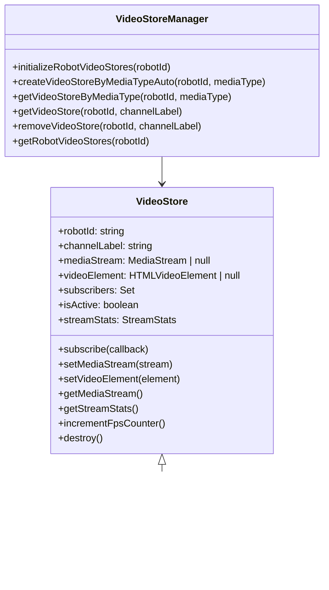
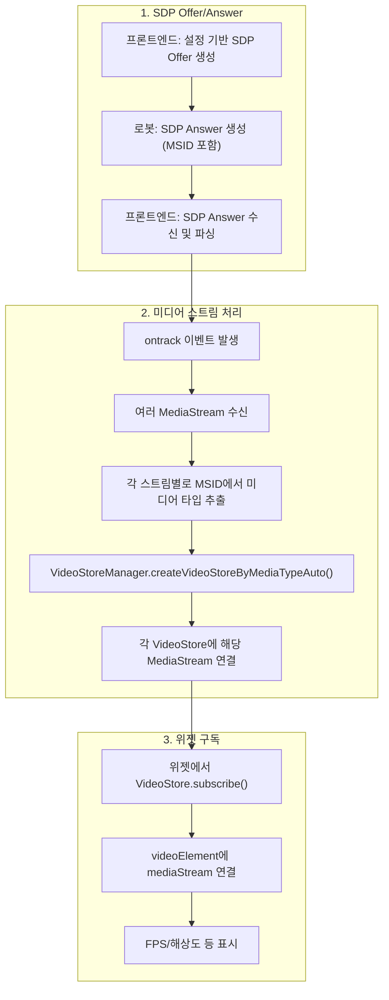
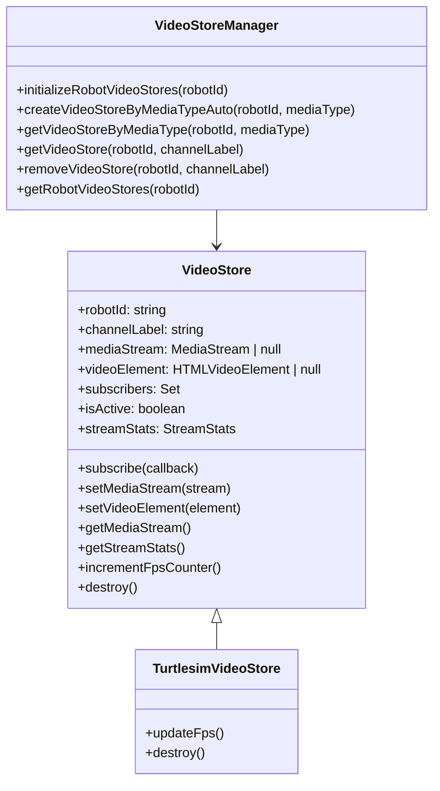
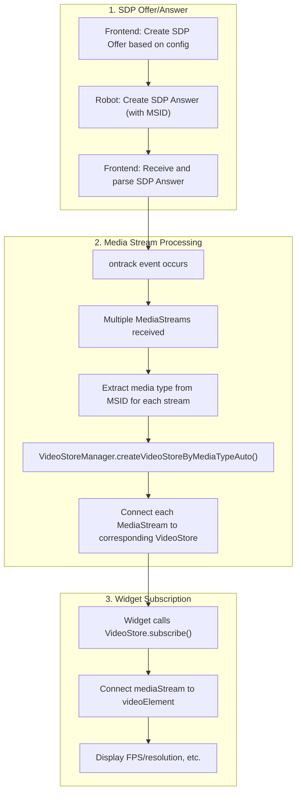

# Media Stream Setup and Management Guide

## 한국어 (Korean)

### 목차
1. [Video Store 구조](#1-video-store-구조)
2. [Video Store 내부 처리 및 로봇 메타데이터](#2-video-store-내부-처리-및-로봇-메타데이터)
3. [새로운 비디오 트랙 추가 방법](#3-새로운-비디오-트랙-추가-방법)

---

### 1. Video Store 구조

#### 1.1 개념 및 역할
- Video Store는 WebRTC MediaStream을 실시간으로 구독자(위젯 등)에 전달하는 역할을 담당합니다.
- 데이터 저장 없이, 들어오는 스트림을 바로 연결 및 전달합니다.

#### 1.2 클래스 구조 (예시)


#### 1.3 주요 컴포넌트
- **VideoStore**: MediaStream 전달, FPS 측정, 통계 관리
- **TurtlesimVideoStore**: VideoStore 확장, 특정 비디오 스트림 처리
- **VideoStoreManager**: 싱글턴, 미디어 타입별 store 관리 및 자동 생성/정리

---

### 2. Video Store 내부 처리 및 로봇 메타데이터

#### 2.1 전체 데이터 플로우


#### 2.2 MSID 기반 미디어 타입 파싱
- SDP Answer의 `a=msid-semantic: WMS ...` 라인에서 미디어 타입을 한 줄에 배열처럼 공백으로 구분해 나열합니다.
- 예시:
  ```
  a=msid-semantic: WMS turtlesim_video go2_camera ouster_lidar
  ```
- 각 미디어 스트림은 `a=msid:{media_type} {uuid}` 형식으로 구분됩니다.

#### 2.3 프론트엔드 파싱 예시
```typescript
// webrtc-sdp-utils.ts
export function parseMetadataFromSdp(sdp: string): Map<string, any> {
  const metadata = new Map<string, any>();
  const normalizedSdp = sdp.replace(/\r\n/g, '\n').replace(/\r/g, '\n');
  const lines = normalizedSdp.split('\n');
  
  // MSID semantic에서 모든 미디어 타입 파싱
  for (const line of lines) {
    const msidSemanticMatch = line.match(/^a=msid-semantic:\s+WMS\s+(.+)$/);
    if (msidSemanticMatch) {
      const mediaTypes = msidSemanticMatch[1].trim().split(' ');
      metadata.set('mediaTypes', mediaTypes);
      break;
    }
  }
  
  // 각 미디어 스트림의 MSID 파싱
  const mediaStreams: Array<{mediaType: string, streamId: string}> = [];
  for (const line of lines) {
    const msidMatch = line.match(/^a=msid:\s*([^\s]+)\s+([^\s]+)$/);
    if (msidMatch) {
      const mediaType = msidMatch[1].trim();
      const streamId = msidMatch[2].trim();
      mediaStreams.push({ mediaType, streamId });
    }
  }
  
  metadata.set('mediaStreams', mediaStreams);
  return metadata;
}
```

#### 2.4 여러 미디어 스트림 처리 예시
```typescript
// webrtc-connection.ts
this.peerConnection.ontrack = (event) => {
  if (event.track.kind === 'video') {
    // 모든 미디어 스트림 처리
    event.streams.forEach((stream, index) => {
      // MSID에서 해당 스트림의 미디어 타입 추출
      const mediaType = this.getMediaTypeFromStream(stream, metadata);
      
      if (mediaType && MediaChannelConfigUtils.isSupportedMediaType(mediaType)) {
        const videoStoreManager = VideoStoreManager.getInstance();
        const videoStore = videoStoreManager.createVideoStoreByMediaTypeAuto(
          this.config.robotId, 
          mediaType
        );
        
        if (videoStore) {
          videoStore.setMediaStream(stream);
          console.log(`Video Store connected: ${mediaType} for robot ${this.config.robotId}`);
        }
      }
    });
  }
};
```

---

### 3. 새로운 비디오 트랙 추가 방법

#### 3.1 Media Channel 설정 추가
- `frontend/src/rtc/webrtc-media-channel-config.ts`에 새로운 미디어 타입 추가
```typescript
export const MEDIA_CHANNEL_CONFIG = {
  'turtlesim_video': { ... },
  'new_video': {
    type: 'new_video',
    channelType: 'readonly' as const,
    defaultLabel: 'new_video'
  }
} as const;
```

#### 3.2 VideoStore 클래스 생성
- `frontend/src/dashboard/store/media-channel-store/new-video.store.ts` 파일 생성
- VideoStore 상속, 필요한 메서드 오버라이드

#### 3.3 VideoStoreManager에 팩토리 추가
- `video-store-manager.ts`의 storeFactories에 등록

#### 3.4 위젯 생성 및 등록
- `NewVideoWidget.tsx` 생성
- `WidgetFactory.tsx`, `types.ts`, `AddWidgetModal.tsx` 등에서 타입 및 팩토리 등록

#### 3.5 로봇 SDP Answer에 미디어 타입 추가
- 예시:
  ```
  a=msid-semantic: WMS turtlesim_video new_video
  a=msid:turtlesim_video ef34ef46-a528-4d61-b197-81cf0a97aae4
  a=msid:new_video 8caa385d-58ef-4a3e-86c9-a5cacf1466b9
  ```

---

## English

### Table of Contents
1. [Video Store Structure](#1-video-store-structure)
2. [Video Store Internal Processing and Robot Metadata](#2-video-store-internal-processing-and-robot-metadata)
3. [Adding New Video Tracks](#3-adding-new-video-tracks)

---

### 1. Video Store Structure

#### 1.1 Concept and Role
- The Video Store delivers WebRTC MediaStream to subscribers (such as widgets) in real time.
- It does not store data; it simply connects and delivers incoming streams.

#### 1.2 Class Structure (Example)


#### 1.3 Main Components
- **VideoStore**: Delivers MediaStream, measures FPS, manages statistics
- **TurtlesimVideoStore**: Extends VideoStore, handles specific video streams
- **VideoStoreManager**: Singleton, manages stores by media type, auto-creates/cleans up

---

### 2. Video Store Internal Processing and Robot Metadata

#### 2.1 Overall Data Flow


#### 2.2 MSID-based Media Type Parsing
- In the SDP Answer, the `a=msid-semantic: WMS ...` line lists media types in a single line, separated by spaces.
- Example:
  ```
  a=msid-semantic: WMS turtlesim_video go2_camera ouster_lidar
  ```
- Each media stream is specified as `a=msid:{media_type} {uuid}`.

#### 2.3 Frontend Parsing Example
```typescript
// webrtc-sdp-utils.ts
export function parseMetadataFromSdp(sdp: string): Map<string, any> {
  const metadata = new Map<string, any>();
  const normalizedSdp = sdp.replace(/\r\n/g, '\n').replace(/\r/g, '\n');
  const lines = normalizedSdp.split('\n');
  
  // Parse all media types from MSID semantic
  for (const line of lines) {
    const msidSemanticMatch = line.match(/^a=msid-semantic:\s+WMS\s+(.+)$/);
    if (msidSemanticMatch) {
      const mediaTypes = msidSemanticMatch[1].trim().split(' ');
      metadata.set('mediaTypes', mediaTypes);
      break;
    }
  }
  
  // Parse MSID for each media stream
  const mediaStreams: Array<{mediaType: string, streamId: string}> = [];
  for (const line of lines) {
    const msidMatch = line.match(/^a=msid:\s*([^\s]+)\s+([^\s]+)$/);
    if (msidMatch) {
      const mediaType = msidMatch[1].trim();
      const streamId = msidMatch[2].trim();
      mediaStreams.push({ mediaType, streamId });
    }
  }
  
  metadata.set('mediaStreams', mediaStreams);
  return metadata;
}
```

#### 2.4 Multiple Media Streams Processing Example
```typescript
// webrtc-connection.ts
this.peerConnection.ontrack = (event) => {
  if (event.track.kind === 'video') {
    // Process all media streams
    event.streams.forEach((stream, index) => {
      // Extract media type from MSID for this stream
      const mediaType = this.getMediaTypeFromStream(stream, metadata);
      
      if (mediaType && MediaChannelConfigUtils.isSupportedMediaType(mediaType)) {
        const videoStoreManager = VideoStoreManager.getInstance();
        const videoStore = videoStoreManager.createVideoStoreByMediaTypeAuto(
          this.config.robotId, 
          mediaType
        );
        
        if (videoStore) {
          videoStore.setMediaStream(stream);
          console.log(`Video Store connected: ${mediaType} for robot ${this.config.robotId}`);
        }
      }
    });
  }
};
```

---

### 3. Adding New Video Tracks

#### 3.1 Add Media Channel Configuration
- Add a new media type to `frontend/src/rtc/webrtc-media-channel-config.ts`
```typescript
export const MEDIA_CHANNEL_CONFIG = {
  'turtlesim_video': { ... },
  'new_video': {
    type: 'new_video',
    channelType: 'readonly' as const,
    defaultLabel: 'new_video'
  }
} as const;
```

#### 3.2 Create VideoStore Class
- Create `frontend/src/dashboard/store/media-channel-store/new-video.store.ts`
- Inherit from VideoStore and override necessary methods

#### 3.3 Register Factory in VideoStoreManager
- Register in `storeFactories` in `video-store-manager.ts`

#### 3.4 Create and Register Widget
- Create `NewVideoWidget.tsx`
- Register type and factory in `WidgetFactory.tsx`, `types.ts`, `AddWidgetModal.tsx`, etc.

#### 3.5 Add Media Type to Robot SDP Answer
- Example:
  ```
  a=msid-semantic: WMS turtlesim_video new_video
  a=msid:turtlesim_video ef34ef46-a528-4d61-b197-81cf0a97aae4
  a=msid:new_video 8caa385d-58ef-4a3e-86c9-a5cacf1466b9
  ```