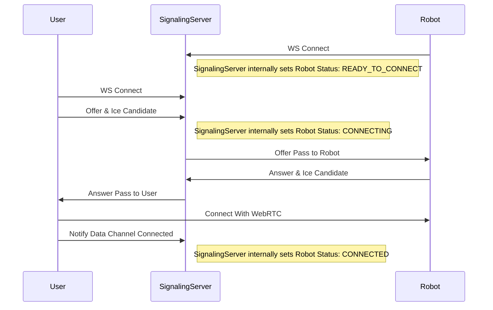
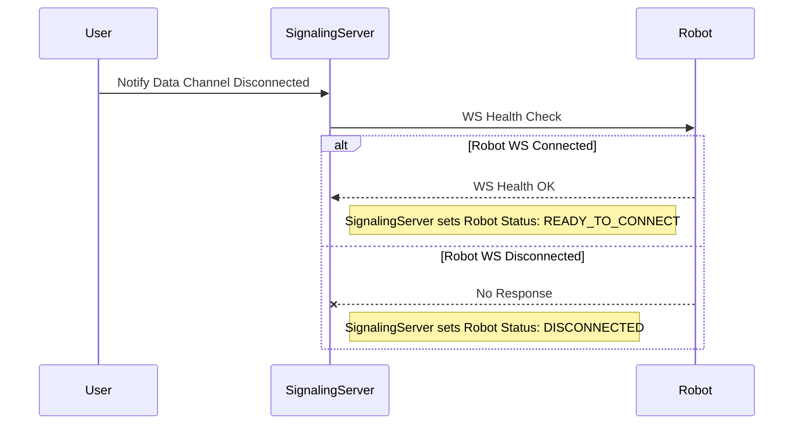
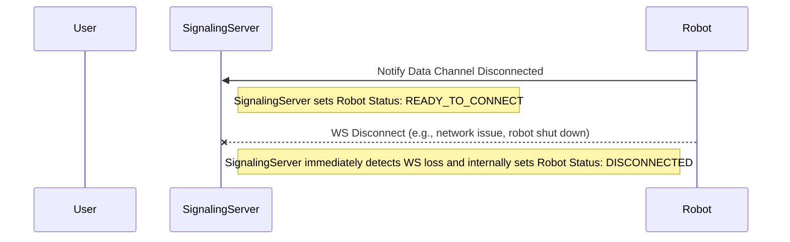

## ROBOT Status Flow

### 1. Data Channel 연결 시나리오

### 2. User Disconnect 시나리오

### 3. Robot Disconnect 시나리오

1. Robot이 WS 연결 시
    - 로봇의 웹 소켓 연결시 로봇의 상태를 READY_TO_CONNECT로 업데이트

2. Data Channel 연결 시
    - User와 Robot의 WebRTC Data Channel이 열리면 Signaling Server에 연결 완료를 알림
    - Signaling Server는 Robot의 상태를 CONNECTED로 업데이트

3. User Disconnect 시나리오
    - User가 Data Channel 연결 해제를 감지하면 Signaling Server에 알림
    - Signaling Server는 Robot과의 WebSocket 연결 상태를 확인
        - WebSocket 연결이 있으면 Robot 상태를 READY_TO_CONNECT로 변경
        - WebSocket 연결이 없으면 Robot 상태를 DISCONNECTED로 변경

4. Robot Disconnect 시나리오
    - Robot이 Data Channel 연결 해제를 감지하면 Signaling Server에 알림
    - Signaling Server는 Robot의 상태를 READY_TO_CONNECT로 업데이트
    - Robot의 WebSocket 연결이 끊어지면 Signaling Server는 즉시 DISCONNECTED 상태로 변경
