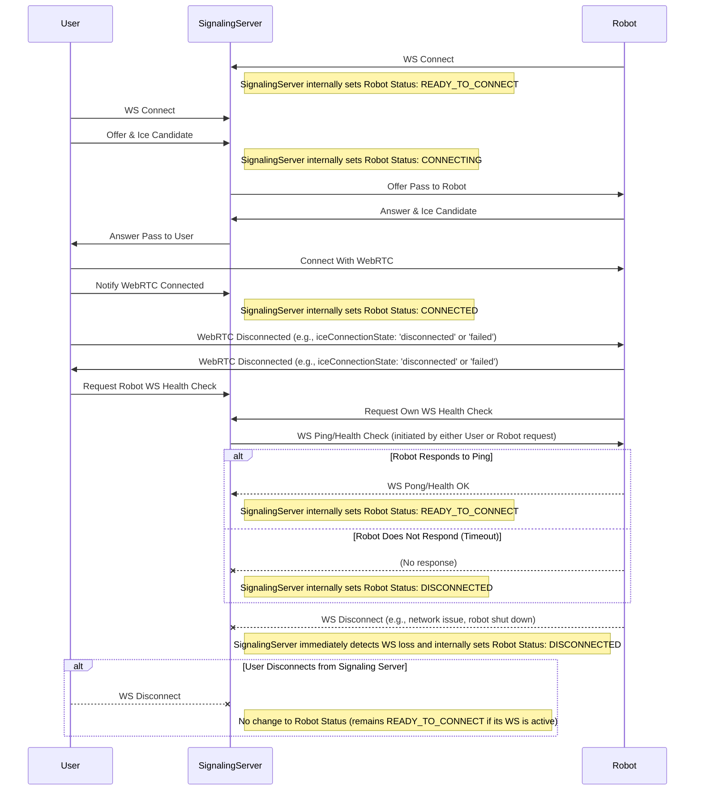

## ROBOT Status Flow

```mermaid
sequenceDiagram
    participant User
    participant SignalingServer
    participant Robot

    Robot ->> SignalingServer : WS Connect
    note right of SignalingServer: SignalingServer internally sets Robot Status: READY_TO_CONNECT

    User ->> SignalingServer : WS Connect
    User ->> SignalingServer : Offer & Ice Candidate
    note right of SignalingServer: SignalingServer internally sets Robot Status: CONNECTING

    SignalingServer ->> Robot : Offer Pass to Robot
    Robot ->> SignalingServer : Answer & Ice Candidate
    SignalingServer ->> User : Answer Pass to User

    User ->> Robot : Connect With WebRTC
    User ->> SignalingServer : Notify WebRTC Connected
    note right of SignalingServer: SignalingServer internally sets Robot Status: CONNECTED

    User ->> Robot: WebRTC Disconnected (e.g., iceConnectionState: 'disconnected' or 'failed')
    Robot ->> User: WebRTC Disconnected (e.g., iceConnectionState: 'disconnected' or 'failed')

    User ->> SignalingServer : Request Robot WS Health Check
    Robot ->> SignalingServer : Request Own WS Health Check

    SignalingServer ->> Robot : WS Ping/Health Check (initiated by either User or Robot request)
    alt Robot Responds to Ping
        Robot -->> SignalingServer : WS Pong/Health OK
        note right of SignalingServer: SignalingServer internally sets Robot Status: READY_TO_CONNECT
    else Robot Does Not Respond (Timeout)
        Robot --x SignalingServer : (No response)
        note right of SignalingServer: SignalingServer internally sets Robot Status: DISCONNECTED
    end

    Robot --x SignalingServer : WS Disconnect (e.g., network issue, robot shut down)
    note right of SignalingServer: SignalingServer immediately detects WS loss and internally sets Robot Status: DISCONNECTED

    alt User Disconnects from Signaling Server
        User --x SignalingServer : WS Disconnect
        note right of SignalingServer: No change to Robot Status (remains READY_TO_CONNECT if its WS is active)
    end
```

1. Robot이 연결 되어 있는데, WebRTC만 끊긴 경우
    - FE , Robot에서 모두 Singnaling server에 WebRTC Disconnected 명령 (둘 중 어디가 죽었거나, 둘 다 살아있는데 WebRTC만 끊긴건지 확인 불가하기 때문)
    - WebRTC Disconnected는 다음과 같은 기능
        - Robot이 CONNECTED,CONNECTING일 경우 :
            - Robot에 Ping을 보내고 응답이 있으면 READY_TO_CONNECT
            - Robot에 Ping을 보내고 응답이 없거나 CONNECTION 정보가 없으면 DISCONNECT
        - DISCONNECT, READY_TO_CONNECT : 유지
