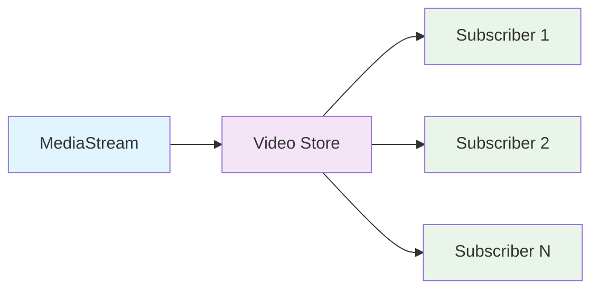
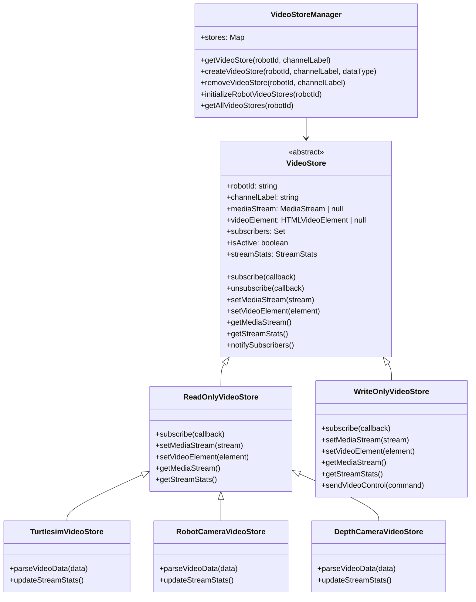

# Video Store Setup and Management Guide

<details>
<summary><strong> 한국어 (Korean)</strong></summary>

## 목차
1. [Video Store 설계 개요](#1-video-store-설계-개요)
2. [Video Store 구조 및 상속 관계](#2-video-store-구조-및-상속-관계)
3. [WebRTC Media Channel 설정](#3-webrtc-media-channel-설정)
4. [SDP Offer/Answer 처리 로직](#4-sdp-offeranswer-처리-로직)
5. [Video Store 연결 및 관리](#5-video-store-연결-및-관리)

---

## 1. Video Store 설계 개요

### 1.1 Data Store와의 차이점

Video Store는 Data Store와 근본적으로 다른 구조를 가집니다:

| 구분 | Data Store | Video Store |
|------|------------|-------------|
| **데이터 저장** | 프레임/데이터를 배열에 저장 | 프레임을 저장하지 않음 |
| **역할** | 데이터 수집 및 관리 | 실시간 스트림 전달자 |
| **메모리 사용** | 누적 데이터로 인한 메모리 증가 | 최소 메모리 사용 |
| **구독자 처리** | 저장된 데이터를 구독자에게 전달 | 실시간 스트림을 구독자에게 즉시 전달 |
| **라이프사이클** | 데이터 수집 → 저장 → 구독자 알림 | 스트림 수신 → 즉시 구독자 전달 |

### 1.2 Video Store 핵심 개념



- **MediaStream**: WebRTC를 통해 수신되는 비디오 스트림
- **Video Store**: 스트림을 구독자들에게 전달하는 중계 역할
- **Subscriber**: 실제 비디오를 표시하는 Widget들

---

## 2. Video Store 구조 및 상속 관계

### 2.1 전체 상속 구조 다이어그램



### 2.2 Video Store 인터페이스

```typescript
interface VideoSubscriber {
  (videoData: VideoData): void;
}

interface VideoData {
  streamId: string;
  robotId: string;
  channelLabel: string;
  mediaStream: MediaStream;
  isActive: boolean;
  stats: StreamStats;
  timestamp: number;
}

interface StreamStats {
  fps: number;
  width: number;
  height: number;
  bitrate?: number;
  packetsLost?: number;
  jitter?: number;
}
```

### 2.3 Video Store 기본 구현

```typescript
abstract class VideoStore {
  protected robotId: string;
  protected channelLabel: string;
  protected mediaStream: MediaStream | null = null;
  protected videoElement: HTMLVideoElement | null = null;
  protected subscribers: Set<VideoSubscriber> = new Set();
  protected isActive: boolean = false;
  protected streamStats: StreamStats = {
    fps: 0,
    width: 0,
    height: 0
  };

  constructor(robotId: string, channelLabel: string) {
    this.robotId = robotId;
    this.channelLabel = channelLabel;
  }

  // 구독자 관리
  subscribe(callback: VideoSubscriber): () => void {
    this.subscribers.add(callback);
    return () => this.subscribers.delete(callback);
  }

  // MediaStream 설정
  setMediaStream(stream: MediaStream): void {
    this.mediaStream = stream;
    this.isActive = stream.active;
    this.notifySubscribers();
  }

  // 구독자들에게 알림
  protected notifySubscribers(): void {
    if (!this.mediaStream) return;

    const videoData: VideoData = {
      streamId: this.mediaStream.id,
      robotId: this.robotId,
      channelLabel: this.channelLabel,
      mediaStream: this.mediaStream,
      isActive: this.isActive,
      stats: this.streamStats,
      timestamp: Date.now()
    };

    this.subscribers.forEach(callback => callback(videoData));
  }
}
```

---

## 3. WebRTC Media Channel 설정

### 3.1 Media Channel 설정 구조

```typescript
// webrtc-media-channel-config.ts
export const MEDIA_CHANNEL_CONFIG = {
  'turtlesim_video': {
    type: 'turtlesim_video',
    channelType: 'readonly' as const,
    defaultLabel: 'turtlesim_video_track',
    description: 'Turtlesim Video Stream',
    msid: {
      streamId: 'turtlesim_video_stream',
      trackId: 'turtlesim_video_track'
    },
    quality: {
      width: 640,
      height: 480,
      framerate: 30,
      bitrate: 1000000
    }
  },
  'robot_camera': {
    type: 'robot_camera',
    channelType: 'readonly' as const,
    defaultLabel: 'robot_camera_track',
    description: 'Robot Camera Stream',
    msid: {
      streamId: 'robot_camera_stream',
      trackId: 'robot_camera_track'
    },
    quality: {
      width: 1280,
      height: 720,
      framerate: 30,
      bitrate: 2000000
    }
  },
  'depth_camera': {
    type: 'depth_camera',
    channelType: 'readonly' as const,
    defaultLabel: 'depth_camera_track',
    description: 'Depth Camera Stream',
    msid: {
      streamId: 'depth_camera_stream',
      trackId: 'depth_camera_track'
    },
    quality: {
      width: 640,
      height: 480,
      framerate: 15,
      bitrate: 1500000
    }
  }
} as const;

// 기본 미디어 채널 설정
export const DEFAULT_MEDIA_CHANNELS = [
  {
    label: MEDIA_CHANNEL_CONFIG.turtlesim_video.defaultLabel,
    dataType: MEDIA_CHANNEL_CONFIG.turtlesim_video.type,
    channelType: MEDIA_CHANNEL_CONFIG.turtlesim_video.channelType,
    msid: MEDIA_CHANNEL_CONFIG.turtlesim_video.msid,
    quality: MEDIA_CHANNEL_CONFIG.turtlesim_video.quality
  },
  {
    label: MEDIA_CHANNEL_CONFIG.robot_camera.defaultLabel,
    dataType: MEDIA_CHANNEL_CONFIG.robot_camera.type,
    channelType: MEDIA_CHANNEL_CONFIG.robot_camera.channelType,
    msid: MEDIA_CHANNEL_CONFIG.robot_camera.msid,
    quality: MEDIA_CHANNEL_CONFIG.robot_camera.quality
  }
] as const;
```

### 3.2 Media Channel 유틸리티 함수

```typescript
export const MediaChannelConfigUtils = {
  /**
   * 미디어 타입이 지원되는지 확인
   */
  isSupportedMediaType(mediaType: string): mediaType is keyof typeof MEDIA_CHANNEL_CONFIG {
    return mediaType in MEDIA_CHANNEL_CONFIG;
  },

  /**
   * 미디어 타입의 기본 라벨 반환
   */
  getDefaultMediaLabel(mediaType: string): string | null {
    const config = MEDIA_CHANNEL_CONFIG[mediaType as keyof typeof MEDIA_CHANNEL_CONFIG];
    return config?.defaultLabel || null;
  },

  /**
   * 미디어 타입의 msid 정보 반환
   */
  getMsidInfo(mediaType: string): { streamId: string; trackId: string } | null {
    const config = MEDIA_CHANNEL_CONFIG[mediaType as keyof typeof MEDIA_CHANNEL_CONFIG];
    return config?.msid || null;
  },

  /**
   * 활성화된 미디어 채널 목록 반환
   */
  getActiveMediaChannels(): string[] {
    return Object.keys(MEDIA_CHANNEL_CONFIG);
  }
};
```

---

## 4. SDP Offer/Answer 처리 로직

### 4.1 SDP Offer 생성 시 msid 추가

```typescript
// SDP Offer 생성 시 미디어 채널 설정 적용
async function createOfferWithMediaChannels(
  peerConnection: RTCPeerConnection,
  activeMediaChannels: string[]
): Promise<RTCSessionDescriptionInit> {
  
  // 기본 Offer 생성
  const offer = await peerConnection.createOffer({
    offerToReceiveVideo: true,
    offerToReceiveAudio: false
  });

  // 활성화된 미디어 채널에 따라 SDP 수정
  const modifiedSdp = addMsidToSdp(offer.sdp, activeMediaChannels);
  
  return {
    type: 'offer',
    sdp: modifiedSdp
  };
}

// SDP에 msid 정보 추가
function addMsidToSdp(sdp: string, activeMediaChannels: string[]): string {
  const lines = sdp.split('\n');
  const modifiedLines: string[] = [];
  
  let mediaSectionIndex = 0;
  
  for (const line of lines) {
    modifiedLines.push(line);
    
    // 미디어 섹션 시작 감지
    if (line.startsWith('m=video')) {
      const mediaType = activeMediaChannels[mediaSectionIndex];
      if (mediaType && MediaChannelConfigUtils.isSupportedMediaType(mediaType)) {
        const msidInfo = MediaChannelConfigUtils.getMsidInfo(mediaType);
        if (msidInfo) {
          modifiedLines.push(`a=msid:${msidInfo.streamId} ${msidInfo.trackId}`);
        }
      }
      mediaSectionIndex++;
    }
  }
  
  return modifiedLines.join('\n');
}
```

### 4.2 SDP Answer 처리 및 Video Store 연결

```typescript
// SDP Answer 수신 시 Video Store 연결
function handleSdpAnswer(
  peerConnection: RTCPeerConnection,
  answer: RTCSessionDescriptionInit,
  videoStoreManager: VideoStoreManager,
  robotId: string
): void {
  
  // SDP에서 msid 정보 추출
  const msidMap = parseMsidFromSdp(answer.sdp);
  
  // 각 미디어 트랙에 대해 Video Store 연결
  peerConnection.ontrack = (event) => {
    if (event.track.kind === 'video' && event.streams && event.streams[0]) {
      const stream = event.streams[0];
      const trackId = event.track.id;
      const streamId = msidMap.get(trackId);
      
      if (streamId) {
        // msid 정보를 기반으로 Video Store 찾기
        const channelLabel = findChannelLabelByMsid(streamId, trackId);
        if (channelLabel) {
          const videoStore = videoStoreManager.getVideoStore(robotId, channelLabel);
          if (videoStore) {
            videoStore.setMediaStream(stream);
          }
        }
      }
    }
  };
}

// SDP에서 msid 정보 파싱
function parseMsidFromSdp(sdp: string): Map<string, string> {
  const msidMap = new Map<string, string>();
  const lines = sdp.split('\n');
  
  for (const line of lines) {
    if (line.startsWith('a=msid:')) {
      const parts = line.substring(7).split(' ');
      const streamId = parts[0];
      const trackId = parts[1] || streamId;
      msidMap.set(trackId, streamId);
    }
  }
  
  return msidMap;
}

// msid 정보로 채널 라벨 찾기
function findChannelLabelByMsid(streamId: string, trackId: string): string | null {
  for (const [mediaType, config] of Object.entries(MEDIA_CHANNEL_CONFIG)) {
    if (config.msid.streamId === streamId && config.msid.trackId === trackId) {
      return config.defaultLabel;
    }
  }
  return null;
}
```

---

## 5. Video Store 연결 및 관리

### 5.1 Video Store Manager 구현

```typescript
class VideoStoreManager {
  private stores: Map<string, VideoStore> = new Map();
  private static instance: VideoStoreManager;

  static getInstance(): VideoStoreManager {
    if (!VideoStoreManager.instance) {
      VideoStoreManager.instance = new VideoStoreManager();
    }
    return VideoStoreManager.instance;
  }

  // Video Store 생성 또는 반환
  getVideoStore(robotId: string, channelLabel: string): VideoStore | null {
    const key = this.createKey(robotId, channelLabel);
    return this.stores.get(key) || null;
  }

  // Video Store 생성
  createVideoStore(robotId: string, channelLabel: string, dataType: string): VideoStore {
    const key = this.createKey(robotId, channelLabel);
    
    if (this.stores.has(key)) {
      return this.stores.get(key)!;
    }

    let videoStore: VideoStore;
    
    switch (dataType) {
      case 'turtlesim_video':
        videoStore = new TurtlesimVideoStore(robotId, channelLabel);
        break;
      case 'robot_camera':
        videoStore = new RobotCameraVideoStore(robotId, channelLabel);
        break;
      case 'depth_camera':
        videoStore = new DepthCameraVideoStore(robotId, channelLabel);
        break;
      default:
        throw new Error(`Unknown video data type: ${dataType}`);
    }

    this.stores.set(key, videoStore);
    return videoStore;
  }

  // 로봇의 모든 Video Store 초기화
  initializeRobotVideoStores(robotId: string): void {
    const activeChannels = MediaChannelConfigUtils.getActiveMediaChannels();
    
    activeChannels.forEach(mediaType => {
      const config = MEDIA_CHANNEL_CONFIG[mediaType];
      this.createVideoStore(robotId, config.defaultLabel, mediaType);
    });
  }

  // 로봇의 모든 Video Store 반환
  getAllVideoStores(robotId: string): VideoStore[] {
    const stores: VideoStore[] = [];
    
    for (const [key, store] of this.stores.entries()) {
      if (key.startsWith(`${robotId}:`)) {
        stores.push(store);
      }
    }
    
    return stores;
  }

  // Video Store 제거
  removeVideoStore(robotId: string, channelLabel: string): void {
    const key = this.createKey(robotId, channelLabel);
    this.stores.delete(key);
  }

  private createKey(robotId: string, channelLabel: string): string {
    return `${robotId}:${channelLabel}`;
  }
}
```

### 5.2 Video Store 사용 예시

```typescript
// Widget에서 Video Store 사용
export function VideoWidget({ robotId, channelLabel, dataType }: VideoWidgetProps) {
  const [videoData, setVideoData] = useState<VideoData | null>(null);
  const videoRef = useRef<HTMLVideoElement>(null);

  useEffect(() => {
    // Video Store Manager에서 스토어 가져오기
    const videoStoreManager = VideoStoreManager.getInstance();
    const videoStore = videoStoreManager.getVideoStore(robotId, channelLabel);
    
    if (!videoStore) {
      // 스토어가 없으면 생성
      videoStoreManager.createVideoStore(robotId, channelLabel, dataType);
    }

    // 구독
    const unsubscribe = videoStore.subscribe((data) => {
      setVideoData(data);
      
      // 비디오 엘리먼트에 스트림 연결
      if (videoRef.current && data.mediaStream) {
        videoRef.current.srcObject = data.mediaStream;
      }
    });

    return () => unsubscribe();
  }, [robotId, channelLabel, dataType]);

  return (
    <div>
      <video ref={videoRef} autoPlay playsInline />
      {videoData && (
        <div>
          <p>FPS: {videoData.stats.fps}</p>
          <p>Resolution: {videoData.stats.width}x{videoData.stats.height}</p>
        </div>
      )}
    </div>
  );
}
```

---

</details>

<details>
<summary><strong> English</strong></summary>

## Table of Contents
1. [Video Store Design Overview](#1-video-store-design-overview)
2. [Video Store Structure and Inheritance](#2-video-store-structure-and-inheritance)
3. [WebRTC Media Channel Configuration](#3-webrtc-media-channel-configuration)
4. [SDP Offer/Answer Processing Logic](#4-sdp-offeranswer-processing-logic)
5. [Video Store Connection and Management](#5-video-store-connection-and-management)

---

## 1. Video Store Design Overview

### 1.1 Differences from Data Store

Video Store has a fundamentally different structure from Data Store:

| Aspect | Data Store | Video Store |
|--------|------------|-------------|
| **Data Storage** | Stores frames/data in arrays | Does not store frames |
| **Role** | Data collection and management | Real-time stream relay |
| **Memory Usage** | Memory increases due to accumulated data | Minimal memory usage |
| **Subscriber Handling** | Delivers stored data to subscribers | Immediately delivers real-time streams to subscribers |
| **Lifecycle** | Data collection → Storage → Subscriber notification | Stream reception → Immediate subscriber delivery |

### 1.2 Video Store Core Concepts


- **MediaStream**: Video stream received through WebRTC
- **Video Store**: Relay role that delivers streams to subscribers
- **Subscriber**: Widgets that actually display the video

---

## 2. Video Store Structure and Inheritance

### 2.1 Complete Inheritance Structure Diagram


### 2.2 Video Store Interface

```typescript
interface VideoSubscriber {
  (videoData: VideoData): void;
}

interface VideoData {
  streamId: string;
  robotId: string;
  channelLabel: string;
  mediaStream: MediaStream;
  isActive: boolean;
  stats: StreamStats;
  timestamp: number;
}

interface StreamStats {
  fps: number;
  width: number;
  height: number;
  bitrate?: number;
  packetsLost?: number;
  jitter?: number;
}
```

### 2.3 Video Store Base Implementation

```typescript
abstract class VideoStore {
  protected robotId: string;
  protected channelLabel: string;
  protected mediaStream: MediaStream | null = null;
  protected videoElement: HTMLVideoElement | null = null;
  protected subscribers: Set<VideoSubscriber> = new Set();
  protected isActive: boolean = false;
  protected streamStats: StreamStats = {
    fps: 0,
    width: 0,
    height: 0
  };

  constructor(robotId: string, channelLabel: string) {
    this.robotId = robotId;
    this.channelLabel = channelLabel;
  }

  // Subscriber management
  subscribe(callback: VideoSubscriber): () => void {
    this.subscribers.add(callback);
    return () => this.subscribers.delete(callback);
  }

  // MediaStream setup
  setMediaStream(stream: MediaStream): void {
    this.mediaStream = stream;
    this.isActive = stream.active;
    this.notifySubscribers();
  }

  // Notify subscribers
  protected notifySubscribers(): void {
    if (!this.mediaStream) return;

    const videoData: VideoData = {
      streamId: this.mediaStream.id,
      robotId: this.robotId,
      channelLabel: this.channelLabel,
      mediaStream: this.mediaStream,
      isActive: this.isActive,
      stats: this.streamStats,
      timestamp: Date.now()
    };

    this.subscribers.forEach(callback => callback(videoData));
  }
}
```

---

## 3. WebRTC Media Channel Configuration

### 3.1 Media Channel Configuration Structure

```typescript
// webrtc-media-channel-config.ts
export const MEDIA_CHANNEL_CONFIG = {
  'turtlesim_video': {
    type: 'turtlesim_video',
    channelType: 'readonly' as const,
    defaultLabel: 'turtlesim_video_track',
    description: 'Turtlesim Video Stream',
    msid: {
      streamId: 'turtlesim_video_stream',
      trackId: 'turtlesim_video_track'
    },
    quality: {
      width: 640,
      height: 480,
      framerate: 30,
      bitrate: 1000000
    }
  },
  'robot_camera': {
    type: 'robot_camera',
    channelType: 'readonly' as const,
    defaultLabel: 'robot_camera_track',
    description: 'Robot Camera Stream',
    msid: {
      streamId: 'robot_camera_stream',
      trackId: 'robot_camera_track'
    },
    quality: {
      width: 1280,
      height: 720,
      framerate: 30,
      bitrate: 2000000
    }
  },
  'depth_camera': {
    type: 'depth_camera',
    channelType: 'readonly' as const,
    defaultLabel: 'depth_camera_track',
    description: 'Depth Camera Stream',
    msid: {
      streamId: 'depth_camera_stream',
      trackId: 'depth_camera_track'
    },
    quality: {
      width: 640,
      height: 480,
      framerate: 15,
      bitrate: 1500000
    }
  }
} as const;

// Default media channel configuration
export const DEFAULT_MEDIA_CHANNELS = [
  {
    label: MEDIA_CHANNEL_CONFIG.turtlesim_video.defaultLabel,
    dataType: MEDIA_CHANNEL_CONFIG.turtlesim_video.type,
    channelType: MEDIA_CHANNEL_CONFIG.turtlesim_video.channelType,
    msid: MEDIA_CHANNEL_CONFIG.turtlesim_video.msid,
    quality: MEDIA_CHANNEL_CONFIG.turtlesim_video.quality
  },
  {
    label: MEDIA_CHANNEL_CONFIG.robot_camera.defaultLabel,
    dataType: MEDIA_CHANNEL_CONFIG.robot_camera.type,
    channelType: MEDIA_CHANNEL_CONFIG.robot_camera.channelType,
    msid: MEDIA_CHANNEL_CONFIG.robot_camera.msid,
    quality: MEDIA_CHANNEL_CONFIG.robot_camera.quality
  }
] as const;
```

### 3.2 Media Channel Utility Functions

```typescript
export const MediaChannelConfigUtils = {
  /**
   * Check if media type is supported
   */
  isSupportedMediaType(mediaType: string): mediaType is keyof typeof MEDIA_CHANNEL_CONFIG {
    return mediaType in MEDIA_CHANNEL_CONFIG;
  },

  /**
   * Return default media label for media type
   */
  getDefaultMediaLabel(mediaType: string): string | null {
    const config = MEDIA_CHANNEL_CONFIG[mediaType as keyof typeof MEDIA_CHANNEL_CONFIG];
    return config?.defaultLabel || null;
  },

  /**
   * Return msid info for media type
   */
  getMsidInfo(mediaType: string): { streamId: string; trackId: string } | null {
    const config = MEDIA_CHANNEL_CONFIG[mediaType as keyof typeof MEDIA_CHANNEL_CONFIG];
    return config?.msid || null;
  },

  /**
   * Return list of active media channels
   */
  getActiveMediaChannels(): string[] {
    return Object.keys(MEDIA_CHANNEL_CONFIG);
  }
};
```

---

## 4. SDP Offer/Answer Processing Logic

### 4.1 Adding msid to SDP Offer

```typescript
// Apply media channel configuration when creating SDP Offer
async function createOfferWithMediaChannels(
  peerConnection: RTCPeerConnection,
  activeMediaChannels: string[]
): Promise<RTCSessionDescriptionInit> {
  
  // Create basic Offer
  const offer = await peerConnection.createOffer({
    offerToReceiveVideo: true,
    offerToReceiveAudio: false
  });

  // Modify SDP based on active media channels
  const modifiedSdp = addMsidToSdp(offer.sdp, activeMediaChannels);
  
  return {
    type: 'offer',
    sdp: modifiedSdp
  };
}

// Add msid information to SDP
function addMsidToSdp(sdp: string, activeMediaChannels: string[]): string {
  const lines = sdp.split('\n');
  const modifiedLines: string[] = [];
  
  let mediaSectionIndex = 0;
  
  for (const line of lines) {
    modifiedLines.push(line);
    
    // Detect media section start
    if (line.startsWith('m=video')) {
      const mediaType = activeMediaChannels[mediaSectionIndex];
      if (mediaType && MediaChannelConfigUtils.isSupportedMediaType(mediaType)) {
        const msidInfo = MediaChannelConfigUtils.getMsidInfo(mediaType);
        if (msidInfo) {
          modifiedLines.push(`a=msid:${msidInfo.streamId} ${msidInfo.trackId}`);
        }
      }
      mediaSectionIndex++;
    }
  }
  
  return modifiedLines.join('\n');
}
```

### 4.2 Processing SDP Answer and Connecting Video Store

```typescript
// Connect Video Store when receiving SDP Answer
function handleSdpAnswer(
  peerConnection: RTCPeerConnection,
  answer: RTCSessionDescriptionInit,
  videoStoreManager: VideoStoreManager,
  robotId: string
): void {
  
  // Extract msid information from SDP
  const msidMap = parseMsidFromSdp(answer.sdp);
  
  // Connect Video Store for each media track
  peerConnection.ontrack = (event) => {
    if (event.track.kind === 'video' && event.streams && event.streams[0]) {
      const stream = event.streams[0];
      const trackId = event.track.id;
      const streamId = msidMap.get(trackId);
      
      if (streamId) {
        // Find Video Store based on msid information
        const channelLabel = findChannelLabelByMsid(streamId, trackId);
        if (channelLabel) {
          const videoStore = videoStoreManager.getVideoStore(robotId, channelLabel);
          if (videoStore) {
            videoStore.setMediaStream(stream);
          }
        }
      }
    }
  };
}

// Parse msid information from SDP
function parseMsidFromSdp(sdp: string): Map<string, string> {
  const msidMap = new Map<string, string>();
  const lines = sdp.split('\n');
  
  for (const line of lines) {
    if (line.startsWith('a=msid:')) {
      const parts = line.substring(7).split(' ');
      const streamId = parts[0];
      const trackId = parts[1] || streamId;
      msidMap.set(trackId, streamId);
    }
  }
  
  return msidMap;
}

// Find channel label by msid information
function findChannelLabelByMsid(streamId: string, trackId: string): string | null {
  for (const [mediaType, config] of Object.entries(MEDIA_CHANNEL_CONFIG)) {
    if (config.msid.streamId === streamId && config.msid.trackId === trackId) {
      return config.defaultLabel;
    }
  }
  return null;
}
```

---

## 5. Video Store Connection and Management

### 5.1 Video Store Manager Implementation

```typescript
class VideoStoreManager {
  private stores: Map<string, VideoStore> = new Map();
  private static instance: VideoStoreManager;

  static getInstance(): VideoStoreManager {
    if (!VideoStoreManager.instance) {
      VideoStoreManager.instance = new VideoStoreManager();
    }
    return VideoStoreManager.instance;
  }

  // Create or return Video Store
  getVideoStore(robotId: string, channelLabel: string): VideoStore | null {
    const key = this.createKey(robotId, channelLabel);
    return this.stores.get(key) || null;
  }

  // Create Video Store
  createVideoStore(robotId: string, channelLabel: string, dataType: string): VideoStore {
    const key = this.createKey(robotId, channelLabel);
    
    if (this.stores.has(key)) {
      return this.stores.get(key)!;
    }

    let videoStore: VideoStore;
    
    switch (dataType) {
      case 'turtlesim_video':
        videoStore = new TurtlesimVideoStore(robotId, channelLabel);
        break;
      case 'robot_camera':
        videoStore = new RobotCameraVideoStore(robotId, channelLabel);
        break;
      case 'depth_camera':
        videoStore = new DepthCameraVideoStore(robotId, channelLabel);
        break;
      default:
        throw new Error(`Unknown video data type: ${dataType}`);
    }

    this.stores.set(key, videoStore);
    return videoStore;
  }

  // Initialize all Video Stores for robot
  initializeRobotVideoStores(robotId: string): void {
    const activeChannels = MediaChannelConfigUtils.getActiveMediaChannels();
    
    activeChannels.forEach(mediaType => {
      const config = MEDIA_CHANNEL_CONFIG[mediaType];
      this.createVideoStore(robotId, config.defaultLabel, mediaType);
    });
  }

  // Return all Video Stores for robot
  getAllVideoStores(robotId: string): VideoStore[] {
    const stores: VideoStore[] = [];
    
    for (const [key, store] of this.stores.entries()) {
      if (key.startsWith(`${robotId}:`)) {
        stores.push(store);
      }
    }
    
    return stores;
  }

  // Remove Video Store
  removeVideoStore(robotId: string, channelLabel: string): void {
    const key = this.createKey(robotId, channelLabel);
    this.stores.delete(key);
  }

  private createKey(robotId: string, channelLabel: string): string {
    return `${robotId}:${channelLabel}`;
  }
}
```

### 5.2 Video Store Usage Example

```typescript
// Using Video Store in Widget
export function VideoWidget({ robotId, channelLabel, dataType }: VideoWidgetProps) {
  const [videoData, setVideoData] = useState<VideoData | null>(null);
  const videoRef = useRef<HTMLVideoElement>(null);

  useEffect(() => {
    // Get store from Video Store Manager
    const videoStoreManager = VideoStoreManager.getInstance();
    const videoStore = videoStoreManager.getVideoStore(robotId, channelLabel);
    
    if (!videoStore) {
      // Create store if it doesn't exist
      videoStoreManager.createVideoStore(robotId, channelLabel, dataType);
    }

    // Subscribe
    const unsubscribe = videoStore.subscribe((data) => {
      setVideoData(data);
      
      // Connect stream to video element
      if (videoRef.current && data.mediaStream) {
        videoRef.current.srcObject = data.mediaStream;
      }
    });

    return () => unsubscribe();
  }, [robotId, channelLabel, dataType]);

  return (
    <div>
      <video ref={videoRef} autoPlay playsInline />
      {videoData && (
        <div>
          <p>FPS: {videoData.stats.fps}</p>
          <p>Resolution: {videoData.stats.width}x{videoData.stats.height}</p>
        </div>
      )}
    </div>
  );
}
```

---

</details> 